# Mercado de compra venta de vivienda en la ciudad de Madrid - Scraper y Análisis de datos.

## Contexto y motivaciones

Este proyecto surge del deseo de desarrollar conocimiento en análisis de datos, tanto en tratamiento estadístico como en las herramientas y tecnologías del sector.

El mercado de vivienda es un tema donde abundan las narrativas pero escasean los análisis basados en evidencia. Los datos no cuentan historias por sí mismos, pero representan un anclaje más sólido que cualquier aporte anecdótico para entender la realidad.

El problema de acceso a la vivienda está cada vez más presente en la agenda política, especialmente tras el periodo inflacionario post-COVID. Este contexto hace del mercado inmobiliario un objeto de estudio relevante.

**Objetivo del proyecto**: Analizar el mercado de compra-venta de viviendas en Madrid mediante un esquema reproducible de Extracción, Transformación y Análisis que permita estudios periódicos futuros.

Para la extracción realicé scraping ético de plataformas de anuncios. El objetivo inicial era capturar la oferta completa de agosto de 2024 (11.416 viviendas), pero al no ser posible, implementé un muestreo aleatorio usando la fecha de publicación como criterio de ordenación.

## Conclusiones del Análisis

El análisis descriptivo del mercado de compra-venta de viviendas en Madrid, basado en una muestra de 610 viviendas extraídas en agosto de 2024, revela patrones consistentes que sintetizo a continuación. Estas conclusiones deben interpretarse considerando las limitaciones metodológicas expuestas: el muestreo no es estrictamente aleatorio, algunos segmentos tienen representación reducida, y los datos corresponden a precios de oferta, no de transacción.

Las palabras subrayadas en amarillo son los nombres de variables y valores clave de nuestro análisis y aparecen en este formato a lo largo de todo el informe.

En cuanto a localización, el `centro` concentra las viviendas de mayor precio tanto en precio en euros (`pee`) como en precio por metro cuadrado (`pmc`), con diferencias más pronunciadas en `pmc` donde el 100% del `p90` se ubica en el `centro` —un dato contundente que subraya la primacía de la ubicación como determinante del valor de mercado. La mediana de `pmc` en el `centro` (~`9.000 €/m²`) prácticamente duplica la de `sur` y `este` (~`4.000 €/m²`-`5.000 €/m²`). `Norte` y `oeste` ocupan posiciones intermedias (~`6.000 €/m²`-`7.000 €/m²`).

En cuanto a características físicas, destaco tres hallazgos. Primero, los `chalets` muestran comportamiento inverso según la métrica: alto `pee` (valor absoluto) pero bajo `pmc` (precio normalizado), confirmando que su elevado precio total responde a la superficie, no a una valoración premium por metro cuadrado. Segundo, las plantas altas (`6ª-7ª`) presentan el `pmc` más elevado, aunque las plantas `8ª+` descienden —resultado que podría reflejar heterogeneidad en este segmento o limitaciones muestrales. Tercero, las viviendas `interior` tienen menor `pee` pero `pmc` similar a las `exterior`, indicando que su menor precio total se debe principalmente al tamaño, no a una penalización por metro cuadrado.

En cuanto a equipamientos, el `ascensor` muestra la asociación más clara y robusta con precio alto, tanto en `pee` como en `pmc`. Esta variable funciona probablemente como proxy de múltiples factores correlacionados: calidad del edificio, antigüedad, ubicación céntrica. Los equipamientos de ocio (`jardín`/`piscina`) presentan relación inversa con el precio, efecto que persiste en `pmc` y confirma que se debe a su concentración en zonas periféricas de menor valor, no al tamaño de las viviendas. El `aire acondicionado` tiene mayor asociación con precio alto que la `calefacción`, sugiriendo que funciona como indicador de calidad/modernidad del inmueble. El `balcón` muestra mayor asociación con `pmc` alto que la `terraza`, posiblemente por su mayor frecuencia en edificios céntricos históricos.

En términos de jerarquía de variables, la localización (`zona`/`subzona`) y el `ascensor` emergen como los predictores más fuertes y consistentes del precio en ambas métricas. La superficie tiene relación positiva con `pee` (esperable) y también con `pmc` (menos obvio), aunque este segundo efecto está probablemente mediado por la correlación entre tamaño y ubicación/calidad. Los equipamientos de ocio (`jardín`/`piscina`) ilustran el riesgo del análisis bivariado: su asociación negativa con el precio refleja distribución geográfica, no efecto causal. La `calefacción` presenta asociación débil o incluso inversa con `pmc`, siendo poco útil como predictor. El estado (`nuevo`/`usado`/`para_reformar`) y la condición `exterior`/`interior` tienen efectos moderados en `pee` pero limitados en `pmc`, indicando que afectan al precio principalmente a través del tamaño.

Respecto a limitaciones, el análisis es descriptivo: identifica patrones y asociaciones que pueden orientar hipótesis, pero no demuestra relaciones causales. Variables no recogidas (antigüedad del edificio, calidades constructivas, proximidad a transporte público, orientación solar) podrían matizar o modificar algunos resultados. Algunos segmentos —distritos periféricos, `obra_nueva`, plantas `8ª+`, `chalets`— tienen muestras reducidas (<50 observaciones) que limitan la robustez de las conclusiones en esos grupos.

Finalmente, los datos corresponden a precios de oferta, no de transacción. Esto puede introducir sesgo si los descuentos de negociación varían sistemáticamente entre segmentos —por ejemplo, si las viviendas de lujo tienen mayor margen de negociación que las económicas. Esta limitación es inherente a los datos de portales inmobiliarios y debe tenerse presente al interpretar los resultados.

No obstante estas limitaciones, el análisis proporciona una caracterización sistemática del mercado madrileño de compra-venta que puede servir como base para estudios más profundos o como referencia para análisis periódicos futuros, objetivo original del proyecto.

## Fases del proyecto

1. **Extracción**: Desarrollo del scraper ético.
2. **Transformación**: Limpieza, eliminación de duplicados, formateo y creación de variables derivadas.
3. **Análisis**: Visualización y extracción de patrones en tres notebooks:
   - `1. EDA.ipynb`: Análisis exploratorio
   - `2. viviendas.ipynb`: Caracterización del parque inmobiliario
   - `3. mercado.ipynb`: Análisis de precios y correlaciones

## Documentación:

A continuación se presenta un resumen de la documentación clave del proyecto y su ubicación:

1. **Carpeta `0. Knowledge (Cursor context)`**: Contiene la documentación del scraper. Los archivos más relevantes son:  
   - `project_description.md`: Descripción general, objetivos y estructura del proyecto.
   - `navegacion_y_selectores.md`: Estrategias de navegación web según el contexto detectado.
   - `proxies.md`: Configuración del servicio de proxies.
   - `reportes.md`: Sistema de reporte para testeo y validación de navegación.
   - `stealth_config.md`: Configuración de herramientas anti-detección.
   - `global_rules.md`: Reglas de comportamiento de Cursor.
   - `nuevos_desarrollos.md`: Registro de cambios y control de versiones.
   - `resultados_scraper.xlsx`: Salida del scraper y entrada para visualizaciones. Incluye:
     * `Distrib muestra`: Muestra y agrupaciones principales.
     * `Variables`: Índice de variables y su ubicación (`1. EDA.ipynb`, `2. viviendas.ipynb` o `3. mercado.ipynb`).

2. **Carpeta `1. EDA`:**
   - `1. EDA.ipynb`: Análisis exploratorio de datos (EDA).

3. **Carpeta `Visualización y Análisis`:**
   - `2. viviendas.ipynb`: Análisis del parque inmobiliario.
   - `3. mercado.ipynb`: Análisis de precios y correlaciones.

4. **Documentos de desarrollo**: Entorno virtual (`venv`), `requirements.txt`, caché de navegación y otros archivos operativos.

# Extracción de datos

Tras decidir extraer datos de plataformas públicas de ofertas inmobiliarias, me centré en el scraping ético, formándome en técnicas avanzadas mediante tutoriales y documentación. El objetivo era lograr una navegación automatizada indetectable y sostenida, capaz de simular comportamiento humano para extraer información sin ser bloqueado.

**Decisiones de arquitectura**:

La primera decisión arquitectónica fue optar por navegación con headless browsers frente a peticiones HTTP directas mediante cliente HTTP. El motivo fue la arquitectura de las webs objetivo (sitios de anuncios publicados por usuarios), las cuales exigían una navegación secuencial para acceder a la información de cada vivienda. Esta elección, además, permitía renderizar JavaScript y gestionar dinámicamente las respuestas del servidor.

La segunda decisión fue la de utilizar un proveedor de proxies rotativos residenciales con el fin de dar soporte a la gran cantidad de navegación exigida, pudiendo distribuir las peticiones y evitar bloqueos por IP.

**Desarrollo del scraper**:

Tras tomar estas decisiones, el desarrollo implicó la puesta en práctica del conocimiento adquirido mediante la incorporación de numerosos elementos: selectores CSS y parsers para la extracción de datos, gestión de identidad de navegación (sesión, fingerprint de navegador, cookies, caché), control de rate limits, latencia y retries, estrategias para superar desafíos de JavaScript y CAPTCHAs, y patrones de navegación humana simulada (think time, scroll time, jitter, secuencias de clicks).

Definido el stack tecnológico —Python con librerías de navegación automatizada y configuración anti-detección—, y los elementos clave a implementar, documenté requisitos y funcionalidades en archivos que sirvieron como repositorio técnico y como contexto para el desarrollo asistido por IA (Cursor IDE + Claude). A partir de esta base, desarrollé el código de forma modular, validando cada fase antes de avanzar.

El resultado es un scraper configurable que permite la extracción en múltiples plataformas inmobiliarias mediante selectores CSS, con output tabulado y estructurado.

# Limpieza y Estructuración de Datos

Los datos que obtenemos directamente de la web están optimizados para ser vistos, no para ser analizados. Esta fase es la que convierte ese texto original, sin estructura, en las variables y métricas clave que necesitamos para la comparación.

### Pasos de Transformación Aplicados
Asegurar la calidad (Limpieza):
1. Eliminamos entradas duplicadas y gestionamos datos faltantes o nulos.
  - Normalizamos formatos para que todas las fechas, monedas y unidades sean coherentes.
2. Descodificar la información (Parsing):
  - Convertimos elementos de texto (precios, superficies) a valores numéricos reales.
  - Identificamos si existen atributos clave de forma binaria (sí/no): ¿Tiene ascensor? ¿Tiene garaje?
  - Estandarizamos las ubicaciones geográficas para poder agrupar por zona.
3. Crear métricas clave (Variables Derivadas):
  - Calculamos el Precio por m², nuestra métrica principal de comparabilidad.
  - Definimos rangos de precio por segmentos (percentiles) y de superficie.
  - Establecemos la jerarquía geográfica (Zona principal → Subzona).
4. Revisión y Consistencia (Validación):
  - Detectamos y manejamos valores atípicos (outliers) que puedan sesgar el análisis.
  - Comprobamos que las variables sean coherentes entre sí y que estén dentro de rangos válidos.

### Herramientas y Flujo de Trabajo

El proceso comenzó con una exploración rápida en Excel, generando un archivo base (`resultados_scraper.xlsx`). Este archivo es el punto de partida para nuestro script de Python/Pandas (`1. EDA.ipynb`), donde se completan las transformaciones y se generan todas las variables analíticas.

### Retos de esta Fase
1. Información Desordenada: Los anuncios originales son muy heterogéneos; a menudo, la información está incompleta, mal etiquetada o escrita de formas distintas.
2. Definición de Segmentos: Establecer los umbrales correctos para clasificar precios y superficies ha requerido varias iteraciones.

El resultado final de esta rigurosa limpieza es un conjunto de datos listo para el análisis de 610 viviendas con 41 variables estructuradas.

# Visualización y Análisis

El análisis presentado es descriptivo y no tiene como objetivo probar o descartar hipótesis. Los notebooks contienen visualizaciones y datos adicionales que permiten profundizar más allá de lo resumido aquí.

Esta fase constituye el output principal del proyecto, estructurado en tres Jupyter Notebooks:

## 1. Análisis Exploratorio de Datos (EDA)

El EDA constituye la fase de reconocimiento sistemático del dataset. Su objetivo es comprender la estructura, calidad y potencial analítico de los datos antes de formular análisis específicos.

**Contenido:**
- Análisis univariado (distribuciones, outliers, valores faltantes) y bivariado (correlaciones entre variables)
- Creación de variables derivadas: `precio_el_metro_cuadrado`, rangos de precio y superficie, agregaciones de equipamiento
- Definición de segmentos por percentiles y agrupaciones geográficas (zona, subzona)
- Establecimiento de umbrales para filtrado de outliers

El resultado es la preparación del dataset para los análisis específicos de las siguientes fases.

**Hallazgos relevantes del EDA:**

El análisis de distribuciones detecta outliers en `metros_cuadrados` que, aunque alejados del rango intercuartílico (`IQR`), corresponden a viviendas plausibles: se concentran en `zonas` que albergan propiedades de gran tamaño (principalmente `chalets` en `norte` y `oeste`) y el resto de sus variables presentan valores coherentes con viviendas reales de alto standing. Decidí conservarlos porque su eliminación sesgaría el análisis hacia viviendas "típicas", perdiendo información relevante sobre el segmento de lujo. Para mayor rigor, reporto estadísticas con y sin outliers cuando la diferencia es sustancial.

El EDA también establece los subconjuntos de datos utilizados en el resto del análisis (definidos en la celda `# Subconjuntos (ALL)` del notebook).

**Enfoque del análisis:**

Adopto una aproximación exploratoria sin hipótesis previas, dejando que los patrones emerjan de los datos. Las conclusiones se ciñen a las tendencias principales; los notebooks contienen visualizaciones adicionales para quien desee mayor granularidad. Cuando formulo hipótesis explicativas, las identifico explícitamente como tales.

La distinción entre `2. viviendas.ipynb` y `3. mercado.ipynb` responde a dos perspectivas complementarias que se detallan a continuación.

## 2. Viviendas

La muestra (610 viviendas de un universo de 11.416) se obtuvo mediante ordenación por fecha de publicación. 

Este criterio de ordenación, aunque no es aleatorio en sentido estricto, no presenta una relación teórica evidente con las variables de interés (precio, superficie, equipamientos), lo que reduce el riesgo de sesgo sistemático. No obstante, factores como estacionalidad de la oferta o perfil de vendedor podrían introducir sesgos no detectados. Esta limitación debe tenerse presente al interpretar los resultados.

Los resultados deben interpretarse con esta cautela, especialmente en segmentos con pocas observaciones.

A nivel de `zona` y `subzona` las muestras superan o rondan las 50 observaciones, permitiendo análisis robustos. A nivel de distrito, algunos casos tienen menos de 20 observaciones, lo que impide análisis fiables a esa granularidad.

Esta fase caracteriza la oferta disponible enfocándose en las propiedades físicas de las viviendas. Se utiliza `precio_en_euros` (`pee`) como variable de segmentación, pero se reserva `precio_el_metro_cuadrado` (`pmc`) para el análisis de mercado.

**Justificación de esta separación:**

- `pee` (precio total) cumple una función dual: además de indicar valor absoluto, segmenta tipologías (viviendas de alto standing vs. económicas) y define perfiles cuando se combina con características físicas.

- `pmc` (precio por m²) es una métrica normalizada que elimina el efecto del tamaño y permite comparar el valor de mercado independientemente de la superficie. Esta distinción es analíticamente relevante: como se verá, los `chalets` presentan alto `pee` pero bajo `pmc`, revelando que su elevado precio total responde a su gran superficie, no a una mayor valoración por metro cuadrado. Por ello se reserva `pmc` para el análisis de mercado en `3. mercado.ipynb`.

**Objetivo:** Dimensionar la oferta por tipología, identificar patrones de características por zona y establecer grupos naturales de viviendas.

### LOCALIZACIÓN

El siguiente gráfico muestra la distribución geográfica de la muestra por `zona` y `subzona`. La concentración en el `centro` es notable: representa más del 60% de las observaciones. 

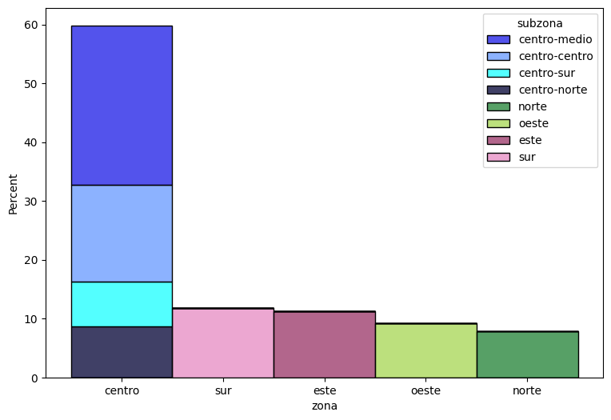 

Los distritos `Salamanca` (133 viviendas) y `Centro` (101) dominan, seguidos por `Moncloa` (41) y `Chamartín` (34). Las zonas periféricas (`sur`, `este`, `oeste`, `norte`) muestran representaciones menores y equilibradas entre sí.

Esta distribución puede reflejar una mayor rotación de oferta en el centro —Los mercados más activos generan más anuncios nuevos— más que un sesgo muestral, aunque esta hipótesis no puede confirmarse con los datos disponibles.

El siguiente gráfico desglosa la muestra por distrito. Varios distritos de la `periferia` quedan por debajo de 20 observaciones, umbral que considero mínimo para análisis estadísticos fiables. Esta limitación condiciona el nivel de granularidad geográfica del análisis.

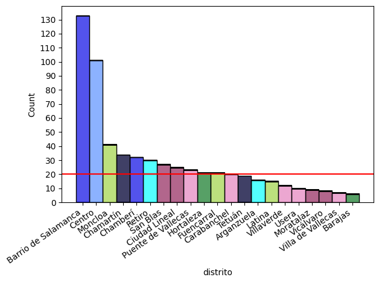

### CARACTERÍSTICAS

##### Tipo de inmueble

El siguiente gráfico compuesto analiza la distribución de `pisos` y `chalets` según `zona`, condición (`nuevo`/`usado`) y localización `centro`/`periferia`.

La muestra está dominada por `pisos` (566 observaciones, 92.8%) frente a `chalets` (44 observaciones, 7.2%). Esta proporción limita la robustez de las conclusiones específicas sobre `chalets`, que deben interpretarse con cautela dado el reducido tamaño muestral.

Los `pisos` tienen presencia en todas las zonas con mayor concentración en el `centro`. Los `chalets` se distribuyen principalmente en zonas periféricas (`norte`, `oeste`, `sur`) con presencia marginal en el `centro`, patrón coherente con la disponibilidad de suelo para vivienda unifamiliar. Ambos tipos muestran predominio de viviendas usadas sobre nuevas, más pronunciado en `pisos`.

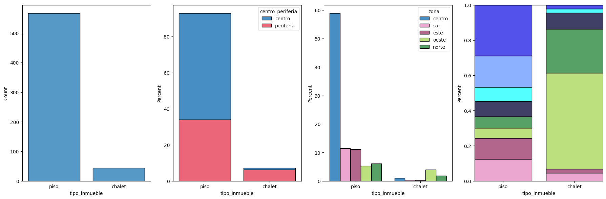

##### Número de Planta

El siguiente gráfico compuesto cruza el número de `planta` con cuatro variables: localización (`centro`/`periferia`), rango de superficie, orientación (`exterior`/`interior`) y estado (`nuevo`/`usado`).

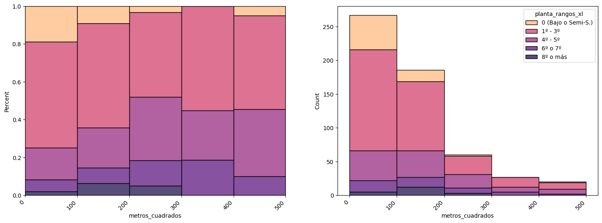

La distribución se concentra en `plantas` intermedias bajas: `1ª`-`3ª` (307 viviendas, ~50%) y `4ª`-`5ª` (120 viviendas). Les siguen `planta baja`/`semi-sótano` (71), `plantas` `6ª`-`7ª` (48), `chalets` (44) y plantas `8ª`+ (20).

El `centro` muestra mayor diversidad de `plantas` con fuerte presencia de intermedias y altas, reflejo de su parque edificatorio más heterogéneo. Las zonas de la `periferia` presentan mayor proporción de plantas bajas y `chalets`. Las viviendas nuevas tienen mayor presencia relativa en plantas altas, mientras que las usadas se distribuyen de forma más equilibrada —hipótesis: la `obra_nueva` reciente en Madrid se ha concentrado en edificios de mayor altura.

El siguiente gráfico explora la relación entre `planta` y `superficie`, comparando el dataset completo con el subconjunto de `pisos` (excluyendo `chalets`, que distorsionan el análisis al tener típicamente 1-2 plantas independientemente de su `superficie`).

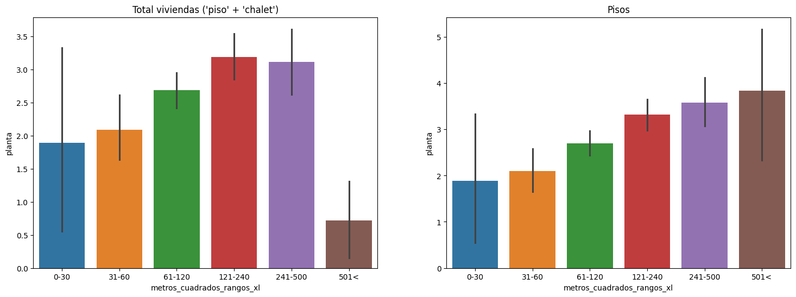

Existe una correlación positiva entre `planta` y `metros cuadrados`, más visible al analizar exclusivamente `pisos`. Esta correlación puede reflejar patrones constructivos históricos: los edificios antiguos del centro suelen tener plantas nobles (1ª-2ª) más amplias, mientras que los edificios modernos con plantas altas tienden a ofrecer viviendas de mayor superficie como producto premium. No obstante, esta es una hipótesis que requeriría datos de antigüedad del edificio para confirmarse.

El siguiente gráfico compuesto compara la distribución de `plantas` por `zona` en términos relativos (proporciones, izquierda) y absolutos (counts, derecha).

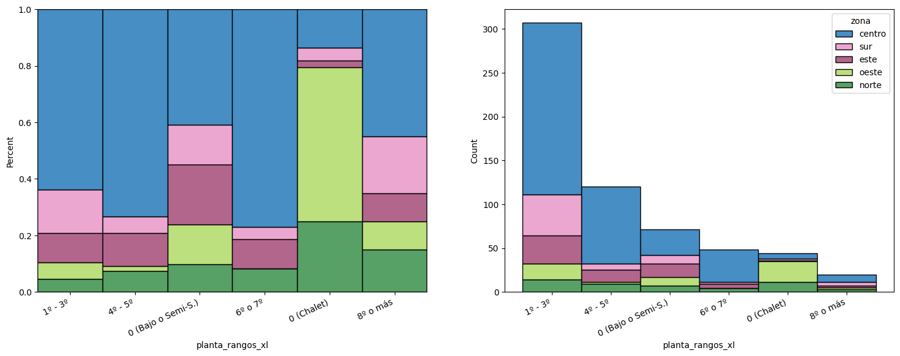

Las `plantas` 1ª-3ª dominan en todas las `zonas` (~50%), pero las plantas altas (`6ª` o superior) se concentran casi exclusivamente en el `centro`. El gráfico de counts confirma que el `centro` acumula la mayor diversidad de plantas, mientras que las zonas periféricas presentan mayor proporción de plantas bajas y `chalets`, especialmente `norte` y `oeste`. Este patrón es coherente con las tipologías edificatorias predominantes en cada `zona`: edificios históricos de altura media-alta en el `centro` versus urbanizaciones de baja densidad en la `periferia`.

##### Exterior / Interior

El siguiente gráfico muestra la proporción de viviendas de `exterior` e `interior` según localización (`centro`/`periferia`).

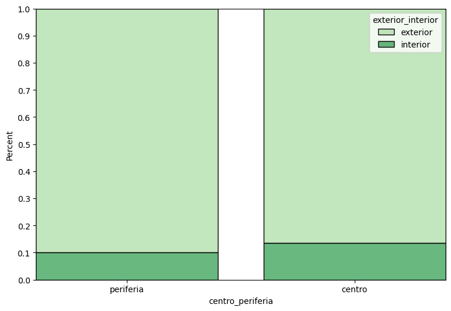

Las viviendas de `exterior` dominan la muestra (540 obs., 88.5%) frente a las de `interior` (70 obs., 11.5%). La proporción de exteriores es ligeramente menor en el `centro` (~86%) que en la `periferia` (~91%). Esta diferencia podría reflejar la mayor densidad edificatoria histórica del `centro`, con más patios interiores y viviendas sin fachada a calle, aunque no es posible confirmarlo con los datos disponibles.

El siguiente gráfico desglosa la proporción `exterior`/`interior` por `zona` y `subzona`, y analiza la distribución geográfica de las viviendas `interiores`.

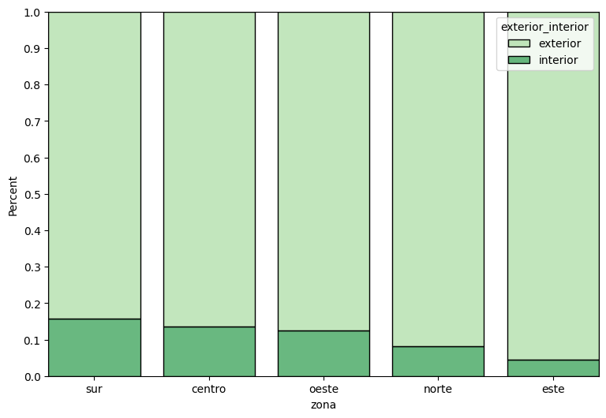

Las zonas `este` y `norte` alcanzan ~95% de viviendas de `exterior`; `centro` y `oeste` presentan las mayores proporciones de `interiores` (~13-15%). Entre las viviendas `interiores`, `centro-centro` concentra la mayor proporción (31.2%), mientras que `norte` representa solo el 6.6%. Este patrón refleja probablemente dos factores combinados: la mayor densidad de edificios antiguos con patios interiores en el `centro` histórico, y el mayor peso muestral de esta subzona.

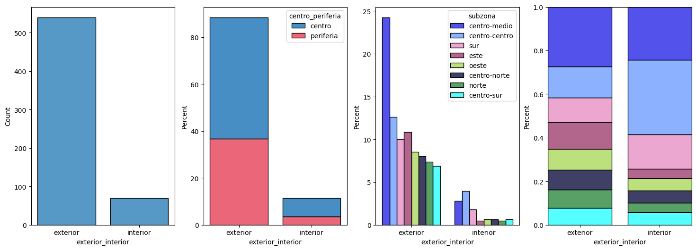

El gráfico compuesto anterior cruza la condición `exterior`/`interior` con múltiples variables. Destaca que las viviendas exteriores muestran mayor diversidad de `superficies`, mientras que las de `interior` se concentran en rangos intermedios (`61 m²`-`240 m²`). La ausencia de viviendas de `interior` de gran superficie (>`300 m²`) es coherente con las limitaciones físicas de los patios interiores en edificios urbanos.

##### Estado de la vivienda

El siguiente gráfico compuesto analiza la distribución del estado de conservación (`obra_nueva`, `obra_usada`, `para_reformar`) según localización y zona.

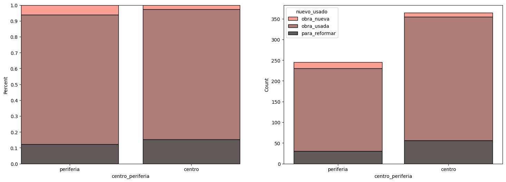

La muestra presenta predominio de `obra_usada` (499 obs., 81.8%), seguida por viviendas `para_reformar` (86 obs., 14.1%) y `obra_nueva` (25 obs., 4.1%). La escasa representación de `obra_nueva` limita las conclusiones sobre este segmento.

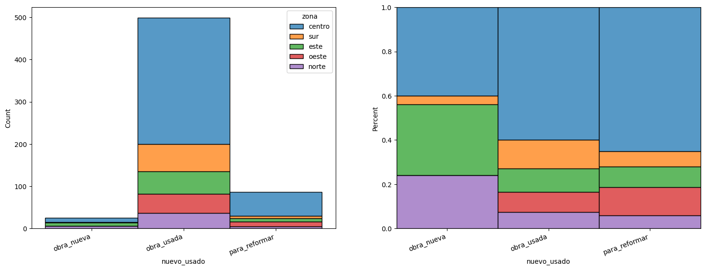

Ambas zonas (`centro` y `periferia`) muestran patrones similares con predominio de `obra_usada` (~82%). El `centro` presenta la mayor diversidad relativa entre categorías. Las viviendas `para_reformar` se concentran en rangos intermedios-altos de superficie (`121 m²`-`500 m²`), mientras que la `obra_nueva` muestra distribución más dispersa.

### ESPACIO

La siguiente tabla muestra las estadísticas descriptivas de `metros_cuadrados`, con y sin filtrado de outliers.

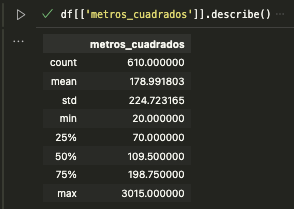

La `superficie` media es de `179 m²` con mediana de `109.5 m²` (diferencia de `69.5 m²`) incluyendo outliers. Tras filtrado a 3×`IQR`, la media cae a `133.5 m²` y la mediana a `103 m²` (diferencia reducida a `30.5 m²`). Esta divergencia entre media y mediana confirma una distribución asimétrica con cola derecha: los outliers sesgan significativamente la media pero apenas afectan la mediana, lo que justifica priorizar la mediana como estadístico de tendencia central en este análisis.

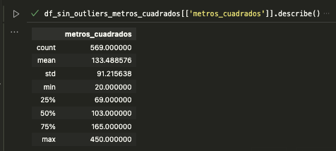

#### Superficie y precio total

Variables: **`precio_en_euros` + `metros_cuadrados`**

El siguiente gráfico de dispersión representa la relación entre `superficie` y `precio total`, diferenciando por rangos de `metros_cuadrados`.

La relación entre `superficie` y `precio total` es lineal positiva, con diferencias marcadas entre `centro` y `periferia`. A partir de ~`150 m²` la dispersión aumenta notablemente, especialmente en el `centro` donde aparecen viviendas de alto valor (>4M€).

Este patrón de heterocedasticidad —variabilidad creciente con el tamaño— tiene una explicación plausible: las viviendas pequeñas constituyen un producto relativamente homogéneo, mientras que en las grandes intervienen más factores diferenciadores (calidades constructivas, ubicación premium, equipamientos de lujo) que amplían el rango de precios posibles.

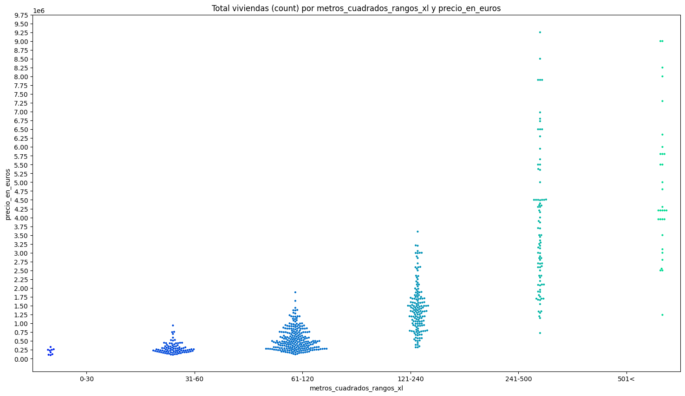

El siguiente gráfico de dispersión con líneas de regresión compara la relación `precio`-`superficie` entre `centro` y `periferia`.

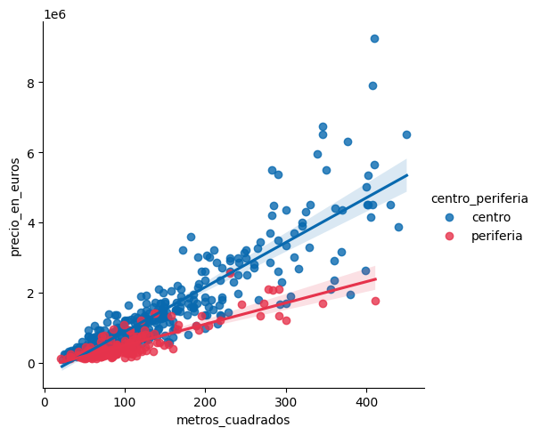

Las líneas de tendencia revelan pendientes diferentes: el `centro` presenta mayor incremento de precio por m² adicional, indicando que cada metro cuadrado añadido "vale más" en ubicaciones céntricas. La `periferia` muestra agrupación más compacta en rangos bajos-medios. La mayoría de viviendas se concentra entre `61 m²`-`240 m²` con precios entre `200K€`-`1M€`.

Los valores extremos superiores no son errores de datos pero sesgan significativamente las medias: corresponden a viviendas de perfil muy concreto (grandes `chalets`), concentradas en las zonas `oeste` y `norte`. La zona `oeste` ilustra este efecto: su media pasa de `417 m²` (con outliers) a `133 m²` (sin outliers), una reducción del 68% que la hace caer del primer al tercer lugar entre `zonas`. Este ejemplo justifica mi decisión de reportar ambas métricas y priorizar medianas cuando la distribución es asimétrica.

Los siguientes gráficos comparan la superficie media por `zona` y `subzona`, con y sin outliers:

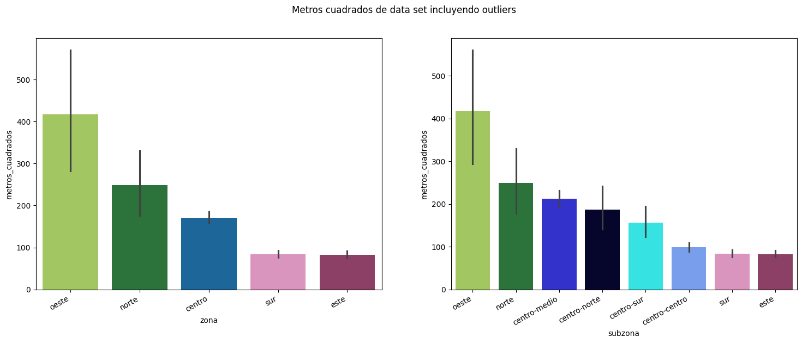

Incluyendo outliers: `oeste` lidera con 417 m² de media, seguido de `norte` (249 m²) y `centro` (170 m²). Sin embargo, las desviaciones estándar son extremas (`oeste`: 533 m², `norte`: 282 m²), señal inequívoca de distribuciones muy dispersas donde la media es poco representativa.

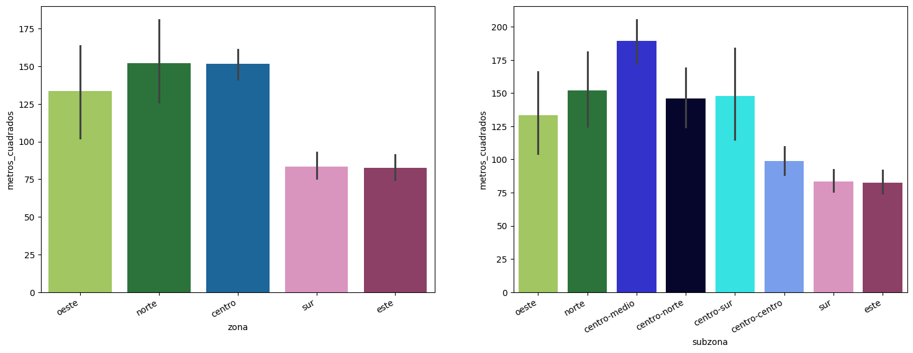

Excluyendo outliers: el ranking cambia sustancialmente. `Centro` y `norte` lideran (~152 m²), `oeste` cae al tercer lugar (134 m²). `Sur` y `este` mantienen las medias más bajas (~83 m²). Que las medianas sean sistemáticamente inferiores a las medias en todas las zonas confirma distribuciones asimétricas con cola derecha, incluso tras el filtrado.

#### Superficie en función de la zona

Variables: **`centro_periferia` + `zona y subzona` + `metros_cuadrados`**

El siguiente gráfico compuesto muestra la distribución de superficies por `zona`, tanto en valores absolutos (counts) como relativos (proporciones).

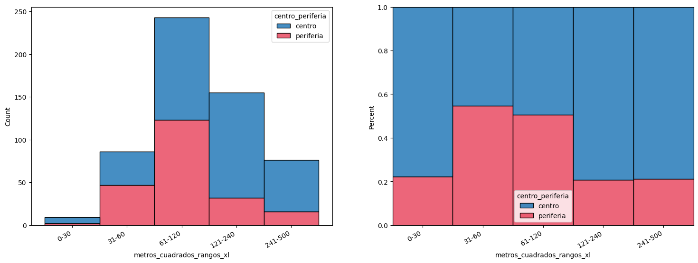

La distribución de superficies difiere entre `centro` y `periferia`. El `centro` presenta mayor concentración relativa en rangos pequeños-medios (`310 m²`-`120 m²`), mientras que la `periferia` tiene mayor peso relativo en superficies grandes (`>241 m²`). Este patrón es coherente con la disponibilidad de suelo: las viviendas grandes requieren parcelas que escasean en el `centro` urbano consolidado.

En términos de proporción relativa, el `centro` representa aproximadamente 20-25% de las viviendas en rangos pequeños-medios (31-120 m²), pero esta proporción disminuye en rangos grandes donde la `periferia` domina.

En cuanto a patrones por `zona`, el `centro` muestra distribución más equilibrada entre rangos pequeños y medianos, mientras que la `periferia` presenta mayor peso de superficies grandes (>241 m²), reflejando la mayor presencia de `chalets` y viviendas unifamiliares. 

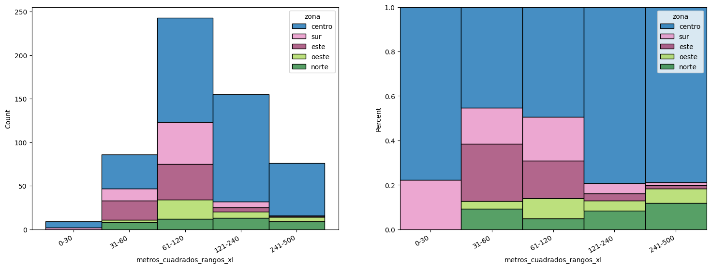

Las estadísticas descriptivas por `zona` revelan diferencias significativas en superficie media. `Norte` y `centro` lideran con medias de ~152 m² y ~151 m² respectivamente, seguidos por `oeste` (~134 m²). `Sur` y `este` presentan las medias más bajas (~83 m²).

En cuanto a variabilidad, todas las `zonas` muestran alta dispersión (desviaciones estándar >36 m²), siendo `centro`, `oeste` y `norte` las más variables (~97 m²). Las medianas son sistemáticamente inferiores a las medias, indicando distribuciones asimétricas. 

Por subzonas, `centro-medio` muestra los valores más altos, seguido por `centro-norte`; las subzonas del `centro` presentan mayor heterogeneidad de superficies, mientras que en la `periferia` la distribución es más homogénea pero con menor superficie media. 

En términos de concentración, las viviendas pequeñas (<100 m²) predominan en zonas periféricas, mientras que las grandes (>300 m²) tienen mayor presencia relativa en `centro`, `norte` y `oeste`.

#### Superficie y tipo de inmueble

Variables: **`tipo_inmueble` + `metros_cuadrados`**

El siguiente gráfico compuesto compara la distribución de superficies entre `pisos` y `chalets`, con y sin filtrado de outliers.

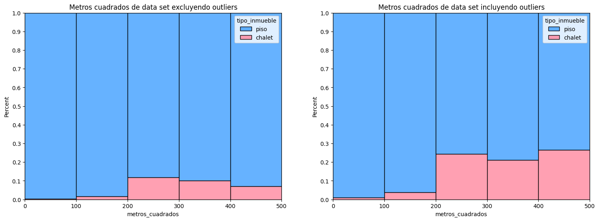

Los `pisos` dominan todos los rangos de `superficie` hasta `240 m²`, representando >95% de las viviendas en rangos pequeños-medios (`31 m²`-`200 m²`). Los `chalets` se concentran en superficies mayores (`>200 m²`).

El filtrado de outliers tiene impacto diferencial por tipo: los `pisos` pasan de 566 a 553 observaciones (-2.3%), mientras que los `chalets` caen de 44 a 16 (-63.6%). Este dato es revelador: los `chalets` contienen una proporción muy alta de valores extremos, lo que confirma que son el principal origen de los outliers de superficie en el dataset. Los gráficos de distribución confirman que los `pisos` presentan distribución concentrada entre `50 m²`-`200 m²`, mientras que los `chalets` muestran mayor dispersión y valores sistemáticamente superiores.

#### Superficie y número de planta

Variables: **`planta, planta_rangos(_xl)` + `metros_cuadrados`**

El siguiente gráfico compuesto cruza la `superficie` con el número de `planta`, mostrando tanto proporciones como valores absolutos.

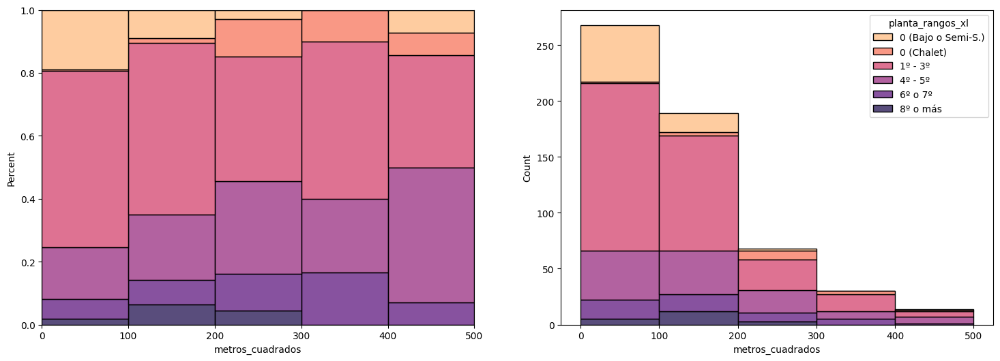

La `superficie` varía según la altura de forma no lineal. Las plantas `bajas`/`semi-sótanos` muestran distribución bimodal (rangos pequeños y grandes), patrón que podría reflejar dos tipologías distintas: locales reconvertidos a vivienda y plantas bajas de edificios señoriales. Los `chalets` dominan los rangos superiores (>200 m²). Las plantas intermedias (`1ª`-`7ª`) se concentran en `61 m²`-`240 m²`, con ligero desplazamiento hacia superficies menores en plantas más altas. Las plantas `8ª+` presentan distribución equilibrada, aunque con muestra limitada (<20 obs.) que aconseja cautela interpretativa.

#### Superficie y Exterior/Interior

Variables: **`metros_cuadrados` + `exterior_interior`**

El siguiente gráfico compuesto analiza la relación entre `superficie` y orientación (`exterior`/`interior`), mostrando tanto proporciones como distribución absoluta.

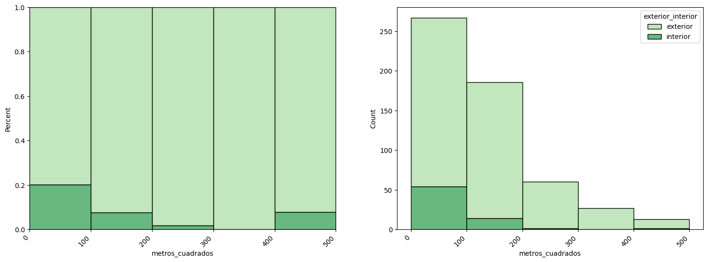

Las viviendas exteriores dominan en todos los rangos de superficie. Las interiores representan ~20% de las viviendas pequeñas (<`100 m²`), proporción que disminuye progresivamente hasta ser prácticamente inexistente por encima de `300 m²`. Esta relación inversa entre `superficie` y proporción de interiores tiene sentido físico: las viviendas interiores dependen de patios cuyas dimensiones limitan el tamaño máximo alcanzable. El histograma confirma que la mayoría de viviendas se concentran entre `50 m²`-`200 m²`.

#### Superficie y Estado de la vivienda

Variables: **`nuevo_usado` + `metros_cuadrados`**

El siguiente gráfico compuesto relaciona la superficie con el estado de conservación (`obra_nueva`, `usada`, `para_reformar`).

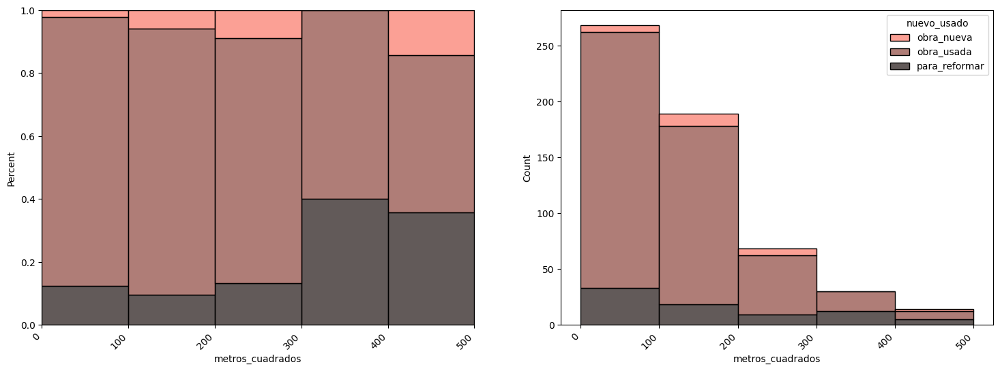

La `obra_nueva` domina en todos los rangos con distribución uniforme entre `50 m²`-`300 m²`. Las viviendas `para_reformar` se concentran en rangos medios-altos (`121 m²`-`300 m²`) con baja presencia en extremos —hipótesis: las viviendas grandes y antiguas son candidatas más frecuentes a reforma integral. La `obra_nueva`, con menor representación absoluta, aparece dispersa en todos los rangos sin concentración clara, aunque la muestra limitada (25 obs.) impide extraer conclusiones robustas.

#### Superficie y total estancias

Variables: **`total_estancias` + `metros_cuadrados`**

El siguiente gráfico compuesto analiza la relación entre número de `total_estancias` y `superficie`, diferenciando por orientación (`exterior`/`interior`) y localización (`centro`/`periferia`).

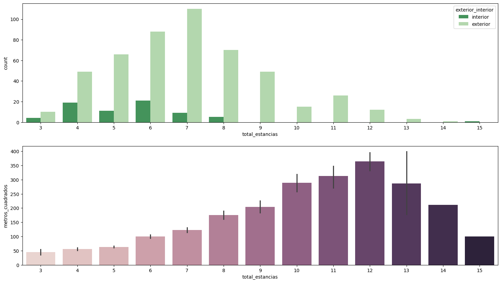

La relación entre `total_estancias` y `superficie` es positiva, como cabría esperar, con moda en 6-7 estancias y superficie media creciente desde ~50 m² (3 estancias) hasta ~350 m² (12 estancias). La dispersión aumenta a partir de 8 estancias.

Un hallazgo interesante: para un mismo número de `estancias`, las viviendas del `centro` suelen tener mayor superficie, diferencia especialmente notable en rangos medios (6-8 estancias). Esto sugiere estancias más amplias en el `centro`, hipótesis coherente con la tipología de edificios históricos de techos altos y distribuciones generosas. El `centro` domina proporcionalmente en viviendas de pocas estancias (3-5, ~60-70%); esta proporción se equilibra en rangos medios y se invierte en rangos altos donde la `periferia` es mayoría, reflejando la presencia de `chalets` con muchas habitaciones.

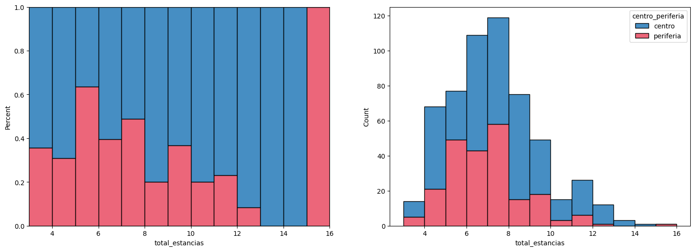

#### Superficie, dormitorios y aseos

Variables: **`num_dormitorios` & `num_aseos` + `metros_cuadrados`**

El siguiente gráfico compuesto relaciona la `superficie` con el número de `dormitorios`, el número de `aseos` y el total de `estancias`, segmentado por rangos de superficie.

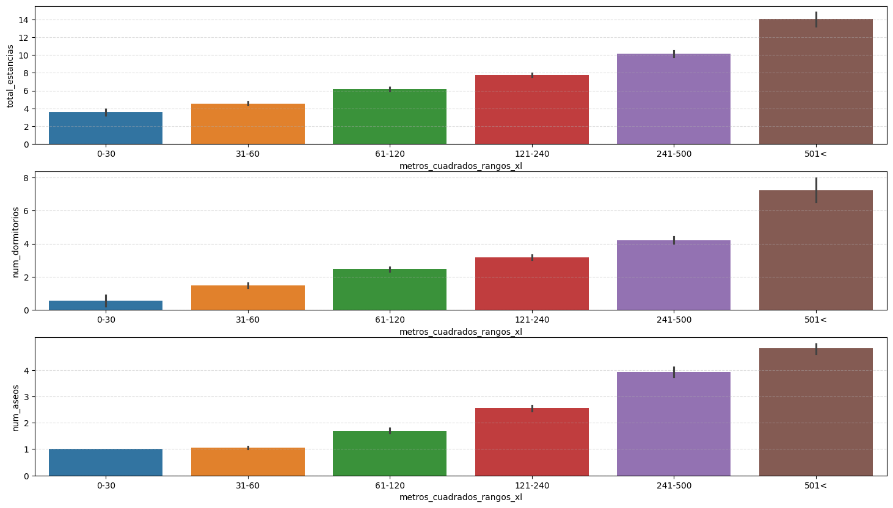

En cuanto a `dormitorios`, la moda es 3 (~120 obs.), seguida de 2 (~110 obs.). Las viviendas de 1 dormitorio son escasas (~15 obs.) y las de 4+ representan una cola derecha decreciente. La superficie media progresa de forma aproximadamente lineal: ~`50 m²` (1 dorm.) → ~`80 m²` (2) → ~`110 m²` (3) → ~`150 m²` (4) → >`200 m²` (5+), con dispersión creciente a partir de 4 dormitorios.

En cuanto a `aseos`, predominan 1-2 (~70% del total). La superficie sigue patrón similar: ~`60 m²` (1 aseo) → ~`100 m²` (2) → ~`150 m²` (3) → >`200 m²` (4+). Las combinaciones más frecuentes son 2-3 dormitorios con 1-2 aseos, configuración típica de la vivienda urbana familiar.

### PRECIO TOTAL y PEE

El precio total (`precio_en_euros` o `pee`) es una variable compuesta que recoge implícitamente el efecto combinado de `superficie`, `localización`, `equipamientos` y `calidades`. A diferencia del precio por metro cuadrado (`pmc`, que se analiza en la sección 3. Mercado), el `pee` resulta útil para segmentar tipologías de producto: una vivienda de 2M€ y otra de 200K€ pertenecen a segmentos de mercado distintos independientemente de sus características individuales, y probablemente se dirigen a perfiles de comprador muy diferentes.

### LOCALIZACIÓN y PEE

El siguiente gráfico compuesto muestra la distribución de percentiles de `pee` por localización (`centro`/`periferia`), tanto en proporciones como en valores absolutos.

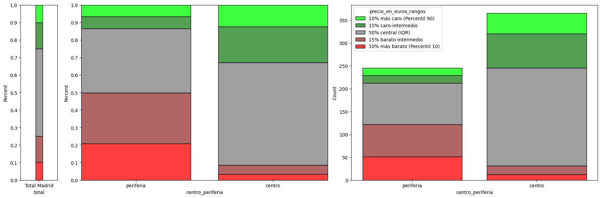

La segregación espacial del precio es clara. El `centro` (365 obs., 59.8%) domina los percentiles altos: concentra 45 de las 61 viviendas en el `p90` (74%), muy por encima de su peso muestral. La `periferia` (245 obs., 40.2%) presenta el patrón inverso, con 51 de las 63 viviendas en el `p10` (81%). Dicho de otro modo: la periferia duplica su representación en viviendas baratas (del 25% poblacional al 50%) e infrarrepresenta las caras (del 25% al ~15%). El centro muestra el patrón inverso aunque menos pronunciado, favorecido por su mayor peso muestral.

El siguiente gráfico desglosa la distribución por `zonas` específicas.

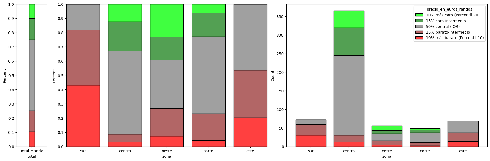

`Sur` y `este` concentran mayor peso de percentiles bajos de `pee`. `Oeste` y `centro` concentran ~40% de viviendas en percentiles altos (vs 25% poblacional). `Norte` se comporta de forma similar a la población general, sin sesgo claro hacia ningún extremo. Las zonas periféricas —`sur` (72 obs.), `este` (69), `oeste` (56) y `norte` (48)— presentan distribuciones de precio más homogéneas entre sí, con mayor concentración en rangos bajos-medios. El `centro` muestra la mayor variabilidad y alcanza los valores máximos del mercado, reflejando su heterogeneidad urbanística (desde viviendas modestas en barrios populares hasta producto de ultra-lujo en el eje Castellana-Salamanca).

### **CARACTERÍSTICAS y PEE**

El siguiente gráfico compuesto analiza la distribución de percentiles de precio según tipo de inmueble (`piso`/`chalet`).

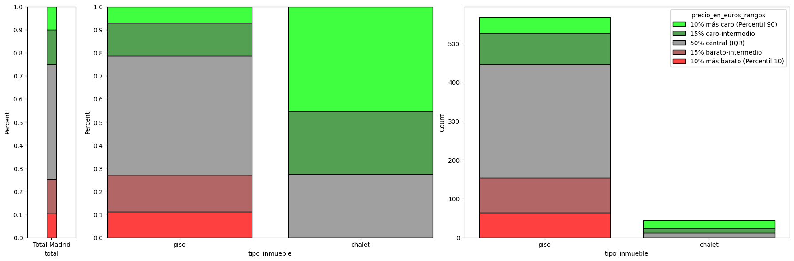

Los `chalets` (44 obs.) muestran sesgo marcado hacia precios altos: ~70% se sitúan en percentiles superiores frente al 25% poblacional. Este resultado es esperable dado que los `chalets` combinan mayor superficie con ubicaciones en zonas residenciales de cierto nivel. Los `pisos` (566 obs., 92.8%) se alinean casi perfectamente con la distribución total, abarcando todos los rangos de precio.

El siguiente gráfico compuesto cruza los percentiles de `pee` con el número de `planta`.

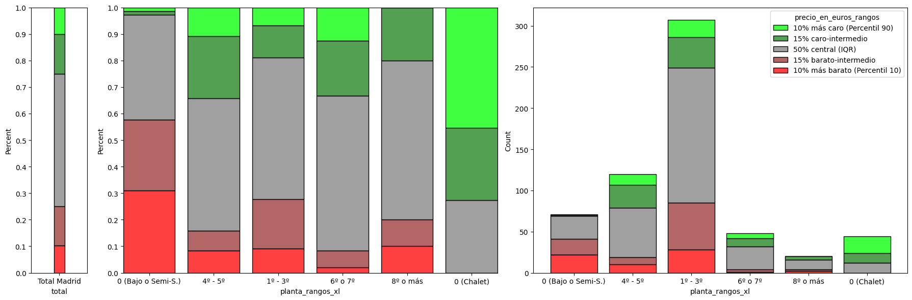

Las plantas `1ª`-`3ª` (307 obs.) presentan distribución equilibrada entre percentiles. Las plantas `4ª`-`5ª` (120 obs.) sesgan hacia precios medios-altos. Las `plantas bajas`/`semi-sótanos` (71 obs.) 

El siguiente gráfico analiza la distribución de `pee` según orientación (`exterior`/`interior`).

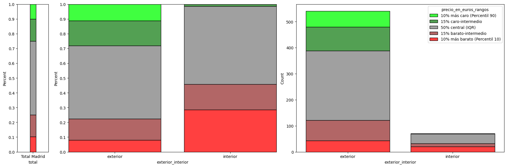

Las viviendas de `exterior` (540 obs., 88.5%) dominan en todos los rangos de `pee`. Las viviendas de `interior` (70 obs., 11.5%) tienen mayor representación en percentiles bajos-medios, sugiriendo una penalización de precio por esta característica que cuantificaré en la sección de Mercado (`pmc`).

El siguiente gráfico muestra la distribución de `pee` según `estado` de conservación.

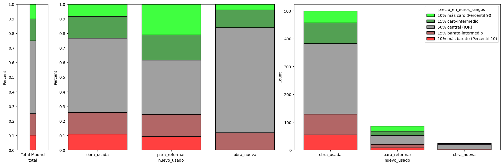

La `obra_usada` (499 obs., 81.8%) abarca todos los percentiles, reflejando su heterogeneidad. Las viviendas `para_reformar` (86 obs., 14.1%) se concentran en rangos medios-bajos, lo cual tiene sentido económico: el precio de oferta debería descontar el coste de la reforma necesaria. La `obra_nueva` (25 obs., 4.1%) sesga hacia percentiles altos, aunque la muestra limitada impide conclusiones robustas.

### **ESPACIO y PEE**

El siguiente gráfico compuesto analiza la distribución de percentiles de `pee` según rangos de `superficie`.

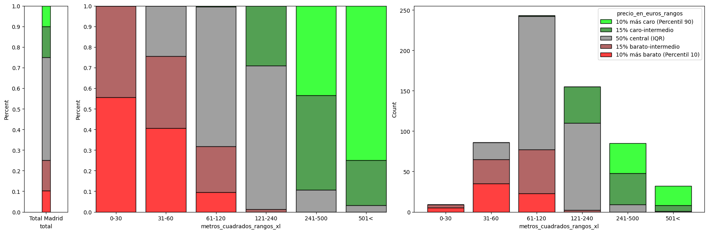

La relación entre `superficie` y `pee` es positiva y progresiva, como cabría esperar. Los rangos pequeños (0-`60 m²`) se concentran en percentiles bajos; el rango `61 m²`-`120 m²` (243 obs., 39.8%) sesga hacia percentiles medios-bajos; los rangos `121 m²`-`240 m²` y `241 m²`-`500 m²` se desplazan hacia percentiles altos; las viviendas >`501 m²` se concentran casi exclusivamente en el percentil más alto.

Un hallazgo relevante: los rangos medios (`61 m²`-`240 m²`, ~65% de la muestra) presentan distribución heterogénea de precio, indicando que otros factores —localización, características, calidades— modulan significativamente el precio más allá de la superficie. Esto justifica el análisis multivariante que sigue.

### **EQUIPAMIENTOS y PEE**

Esta sección analiza la relación entre `equipamientos` y `precio total`. Los equipamientos se codifican como variables binarias (tiene/no tiene) y se analizan mediante dos métricas complementarias: el count (prevalencia de cada configuración en tres grupos de precio: `p10`, `IQR`, `p90`) y el `pee` medio de cada grupo. Esta doble perspectiva permite distinguir entre equipamientos frecuentes en viviendas caras versus equipamientos que elevan el precio medio.

Para el análisis, agrupo los equipamientos en cinco categorías. 

**Agrupación de variables:**
- `ascensor`
- `equip_servicios`: garaje + trastero
- `equip_espacios_de_ocio`: jardín + piscina
- `equip_vistas`: balcón + terraza
- `equip_clima`: aire acondicionado + calefacción

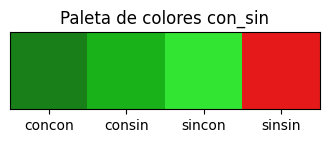

Los equipamientos agrupados se codifican en cuatro combinaciones: `con/con`, `con/sin`, `sin/con`, `sin/sin`. La paleta de colores del gráfico sigue un gradiente de verde (equipamiento completo) a rojo (sin equipamiento). En algunos subgrupos las muestras son pequeñas, lo que limita la robustez del análisis y aconseja interpretar con cautela las diferencias observadas.

##### PEE / Equip. Ascensor

Variables: **`ascensor`**

El siguiente gráfico compuesto muestra el `pee` y la distribución por percentiles según disponibilidad de `ascensor`.

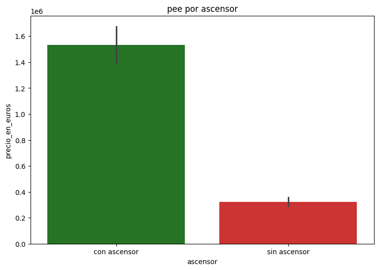

Las viviendas `con ascensor` presentan `pee` medio de ~1,5M€ frente a ~325K€ `sin ascensor`, una diferencia de casi 5x. Esta brecha tan pronunciada refleja, con toda probabilidad, no solo el valor intrínseco del equipamiento sino su correlación con otras características: los edificios con ascensor tienden a ser más modernos, estar en mejores ubicaciones y tener mayores calidades constructivas. Por percentiles, las viviendas `sin ascensor` se concentran en el p10 (~50 obs. vs ~15 con ascensor), mientras que el p90 está compuesto casi exclusivamente por viviendas `con ascensor`.

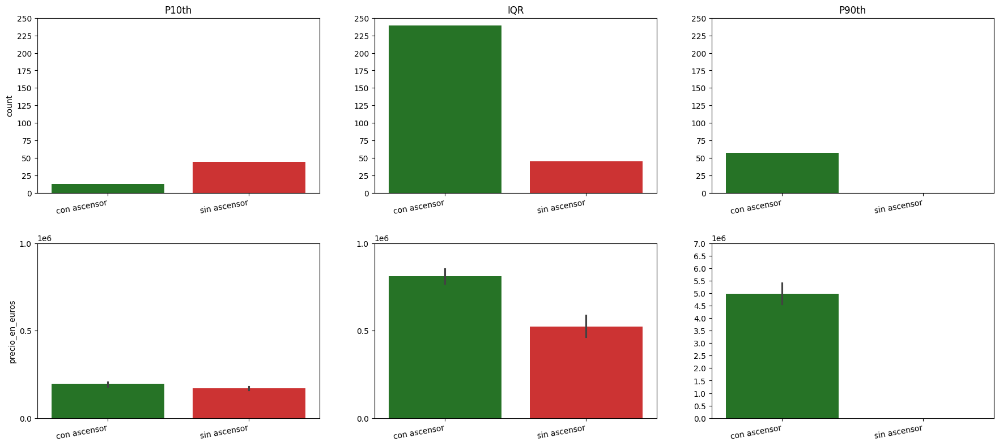

El histograma de proporciones confirma el patrón: las viviendas `sin ascensor` concentran la mayoría de sus observaciones en percentiles bajos de precio (`p10` y barato-intermedio), mientras que las viviendas `con ascensor` presentan distribución desplazada hacia percentiles altos, dominando prácticamente en solitario el `p90`. El ascensor emerge como una de las variables con mayor poder discriminante del precio.

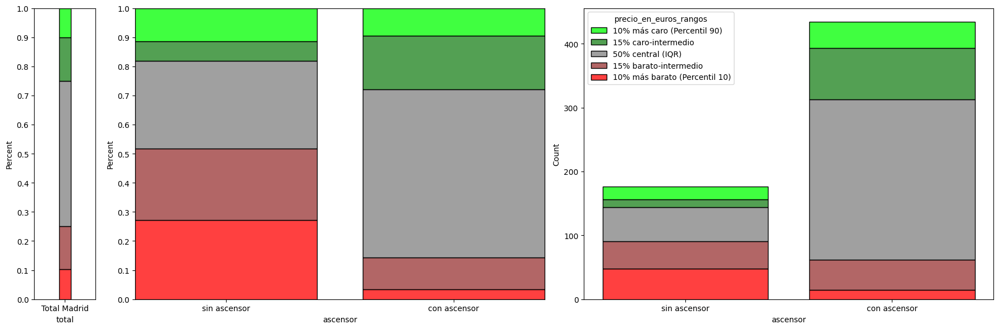

##### PEE / Equip. Servicios

Variables: **`equip_servicios`**

El siguiente gráfico compuesto muestra el `pee` y la distribución por percentiles según disponibilidad de `garaje` y `trastero`.

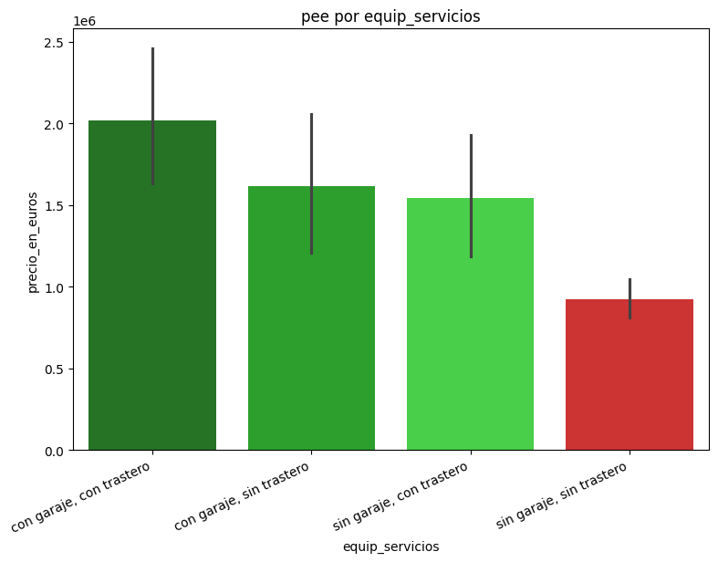

El `pee` decrece conforme se reducen los servicios: ~2M€ en `con/con` (`garaje` y `trastero`) hasta ~1M€ en `sin/sin`, con dispersiones altas especialmente en categorías con mayor equipamiento. Las cuatro categorías tienen representación en todos los tramos, siendo `sin/sin` la más numerosa.

**Nota metodológica importante**: los anuncios no siempre especifican si el `garaje` y/o el `trastero` están incluidos en el precio (`pee`) o se ofrecen como extras opcionales. Esta heterogeneidad en la codificación puede atenuar las diferencias reales entre categorías, ya que viviendas clasificadas como "sin garaje" podrían tenerlo disponible como opción no reflejada en el precio publicado. Los resultados de esta variable deben interpretarse con esta limitación presente.

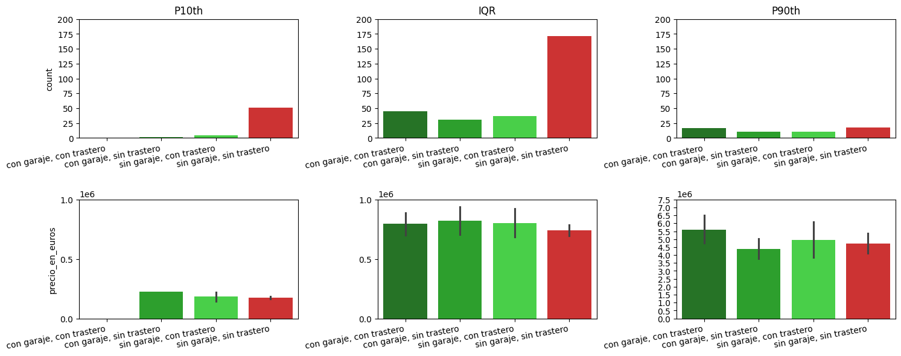

El histograma de proporciones muestra evolución gradual: `con/con` presenta mayor peso relativo en percentiles altos, patrón que se atenúa progresivamente hasta `sin/sin`, donde aumenta la concentración en percentiles bajos. Las diferencias son menos pronunciadas que en `ascensor`, coherente con la menor dispersión de `pee` entre categorías y con la limitación metodológica mencionada.

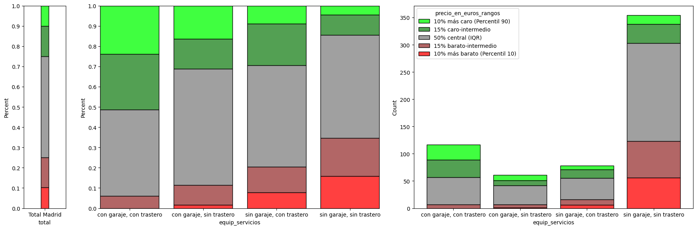

##### PEE / Equip. Ocio

Variables: **`equip_espacios_de_ocio`**

El siguiente gráfico compuesto muestra el precio medio y la distribución por percentiles según disponibilidad de jardín y piscina.

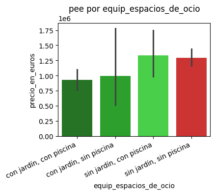

El patrón es contraintuitivo a primera vista: el `pee` aumenta conforme disminuye el equipamiento, pasando de ~0.9M€ en `con/con` a ~1.25M€ en `sin/sin`. Sin embargo, este resultado ilustra claramente el efecto de una variable confusora: `jardín` y `piscina` son más frecuentes en zonas periféricas (`chalets`, `urbanizaciones`) donde el precio por metro cuadrado es sistemáticamente menor. 

La correlación negativa `equipamiento`-`precio` no implica que estos elementos resten valor a la vivienda; refleja su distribución geográfica desigual. Este patrón subraya una limitación fundamental del análisis bivariado: la asociación observada entre dos variables puede estar mediada o confundida por una tercera. La dispersión es alta en todas las categorías; `sin/sin` domina en count y en todos los tramos de percentiles.

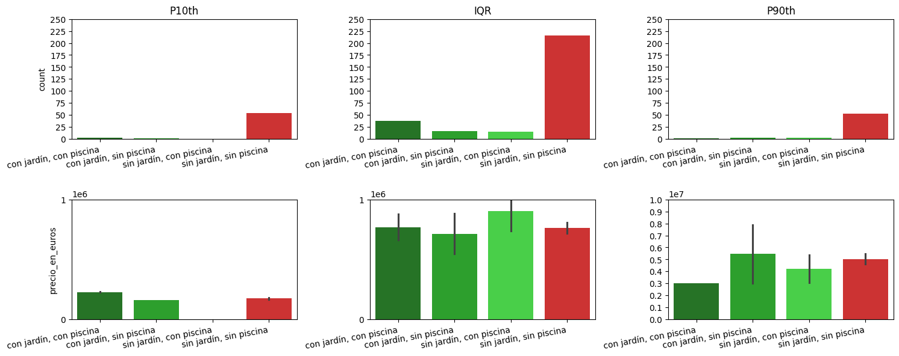

El histograma de proporciones refleja el patrón inverso: `sin/con` (`con piscina sin jardín`) muestra mayor concentración en percentiles altos de `pmc`, mientras que `con/sin` (`con jardín sin piscina`) presenta mayor peso en percentiles bajos. `sin/sin`, pese a dominar en count absoluto, muestra distribución cercana a la poblacional. Este patrón es coherente con la hipótesis de que jardín y piscina correlacionan con localización periférica de menor `pmc`.

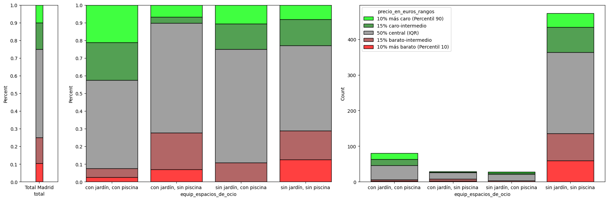

##### PEE / Equip. Vistas

Variables: **`equip_vistas`**

El siguiente gráfico compuesto muestra el `pee` y la distribución por percentiles según disponibilidad de `balcón` y `terraza`.

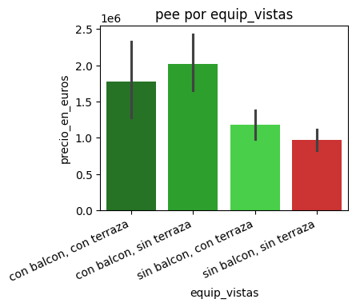

El `pee` es mayor en categorías con balcón: `con/sin` (balcón sin terraza, ~2.0M€) y `con/con` (~1.75M€), ambos con alta dispersión. Las categorías sin balcón presentan valores menores: `sin/con` (terraza sin balcón, ~1.2M€) y `sin/sin` (~1.0M€). El balcón parece tener mayor asociación con precio alto que la terraza, posiblemente porque el balcón es más frecuente en pisos céntricos de edificios históricos, mientras que la terraza (sin balcón) suele asociarse a áticos o viviendas periféricas. La categoría `sin/sin` domina en count absoluto, especialmente en el IQR.

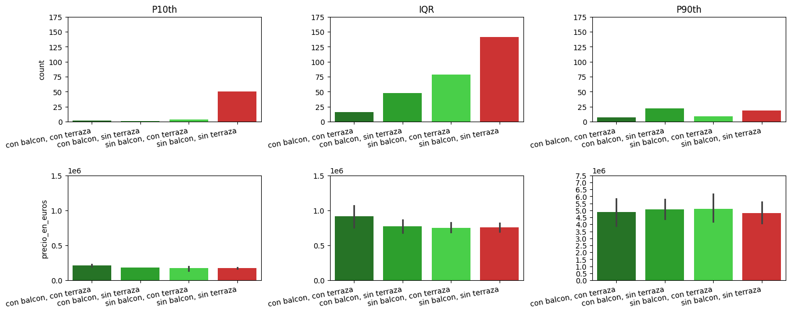

El histograma de proporciones confirma que las categorías `con balcón` (`con/con` y `con/sin`) concentran mayor peso en percentiles altos de `pmc`, especialmente `con/sin` que domina el `p90`. Las categorías `sin balcón` (`sin/con` y `sin/sin`) presentan distribuciones desplazadas hacia percentiles bajos-intermedios.

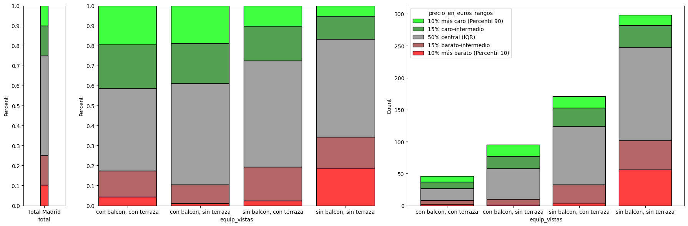

##### PEE / Equip. Clima

Variables: **`equip_clima`**

El siguiente gráfico compuesto muestra el `pee` y la distribución por percentiles según disponibilidad de `aire acondicionado` y `calefacción`.

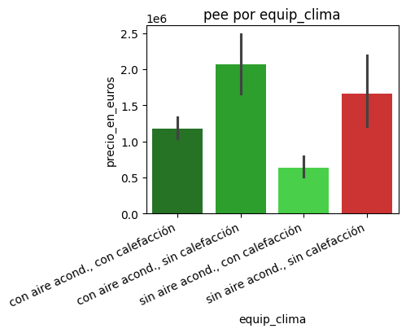

El patrón no es monotónico: `con/sin` (`aire` sin `calefacción`) presenta el `pee` más alto (~2.0M€), seguido de `sin/sin` (~1.6M€, alta dispersión), mientras que `sin/con` (`calefacción` sin `aire`) tiene el más bajo (~0.65M€). Este resultado sugiere que el `aire acondicionado` tiene mayor asociación con precio alto que la `calefacción`. La interpretación plausible es que el `aire acondicionado` funciona como indicador de calidad/modernidad del inmueble, mientras que la `calefacción` es más universal y no discrimina entre segmentos. La categoría `sin/sin` es la más numerosa.

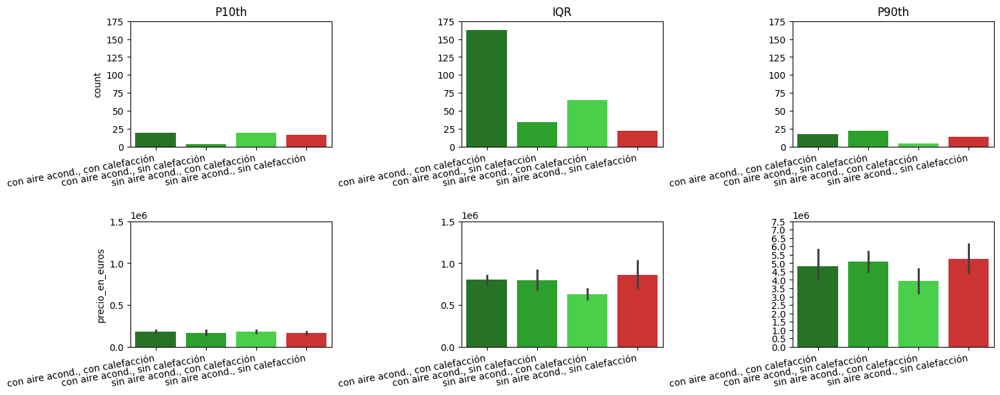

El histograma de proporciones muestra segregación clara: `con/sin` (con `aire`, sin `calefacción`) concentra la mayor proporción de viviendas en `p90`, mientras que `sin/con` (con `calefacción`, sin `aire`) domina en `p10`. La categoría `sin/sin` presenta distribución más equilibrada entre percentiles. Este patrón refuerza que el `aire acondicionado` es mejor predictor de precio alto que la `calefacción`, hallazgo que verificaré también en el análisis de `pmc` (sección 3).

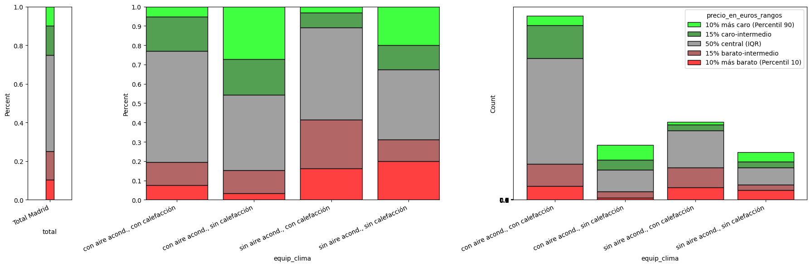

## 3. Mercado (`PMC`)

Esta sección analiza el `pmc` y su relación con las características descritas en la fase anterior. A diferencia del precio total (`pee`), el `pmc` es una métrica normalizada que permite comparar el valor de mercado independientemente del `tamaño` de la vivienda.

**Pregunta central**: ¿Qué variables están más asociadas con las diferencias de `pmc` en el mercado madrileño?

El enfoque combina análisis univariante (correlación `pmc`/`característica`), segmentación (perfiles de vivienda por rango de `pmc`) y análisis geográfico (distribución de `pmc` por `zona` y `subzona`).

La comparación entre `pee` (sección anterior) y `pmc` (esta sección) permite obtener la visión completa: `pee` indica valor absoluto y tipología de producto; `pmc` indica valoración de mercado normalizada. Como veremos, algunas variables que discriminan fuertemente en `pee` tienen efecto atenuado o incluso inverso en `pmc`, lo que revela información valiosa sobre la estructura del mercado.

#### **LOCALIZACIÓN**

##### PMC / Centro o Periferia

Variables: **`pmc` + `centro_periferia`** 

El siguiente gráfico compuesto muestra la distribución de `percentiles` de `pmc` por localización (`centro`/`periferia`), junto con un diagrama de dispersión que relaciona superficie y `pmc`.

La división `centro`/`periferia` se acentúa notablemente respecto a `pee`. Un dato contundente: la totalidad de viviendas en p90 de `pmc` está en el `centro` (literalmente 0 en `periferia`); el patrón inverso ocurre en percentiles bajos. Esto confirma que la localización es el principal determinante del precio por metro cuadrado (`pmc`) en Madrid.

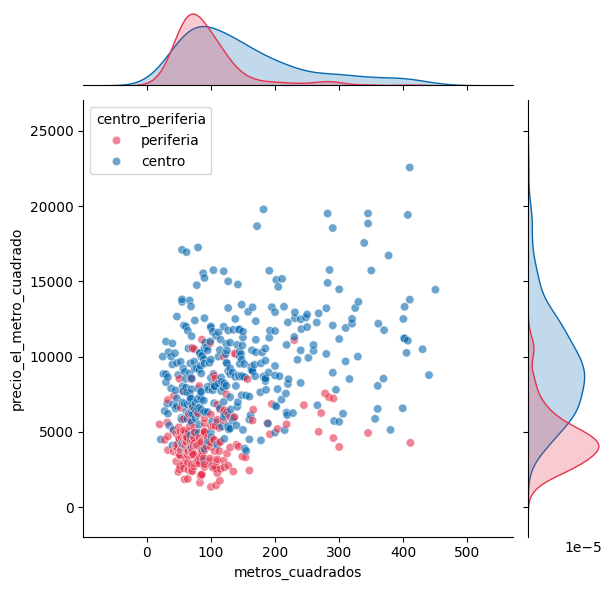

##### PMC / Zona

El siguiente gráfico compuesto desglosa la distribución de pmc por `zonas`, incluyendo diagramas de dispersión (`superficie` vs `pmc`) para `periferia` y `centro`, y boxplots comparativos.

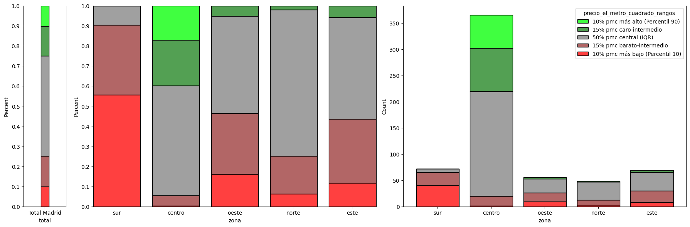

Al desagregar por `zonas`, el patrón se precisa. El incremento de `p90` y decremento de `p10` se concentra exclusivamente en el `centro`. `Oeste` y `norte`, que mostraban presencia en percentiles altos de `pee`, pierden todas sus viviendas de `p90` en `pmc` —su alto `pee` respondía a la superficie, no a una valoración premium por metro cuadrado. `Sur` incrementa ligeramente su presencia en `p90`, mientras que este reduce `p90` y aumenta su banda intermedia-alta.

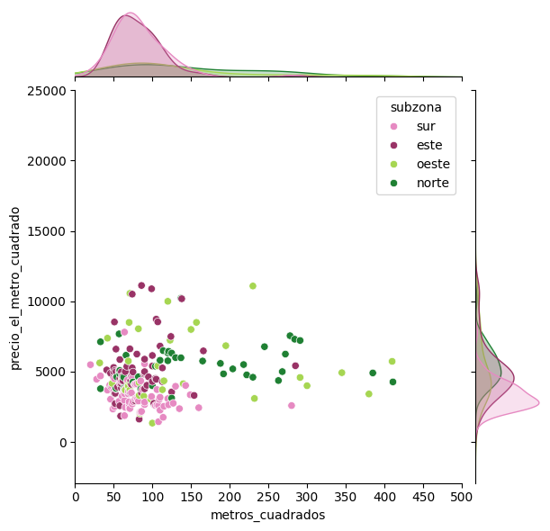

El gráfico anterior muestra la dispersión `pmc`/`superficie` para las zonas periféricas. La concentración en rangos bajos-medios de `pmc` (`2.000€/m²`-`8.000 €/m²`) es evidente, con escasa presencia por encima de `10.000 €/m²` independientemente de la `superficie`.

El siguiente gráfico muestra el mismo análisis para las subzonas del centro.

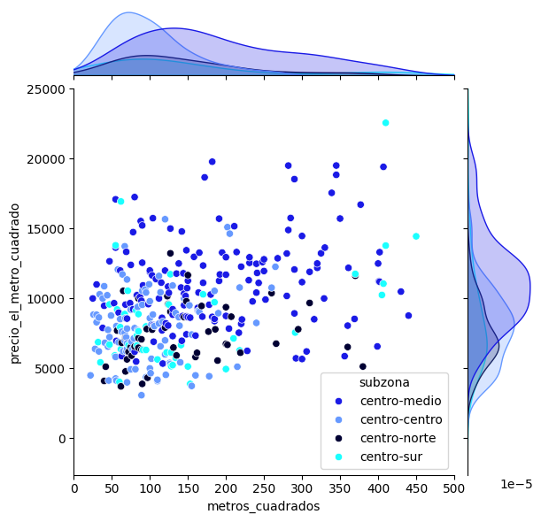

El contraste con la `periferia` es marcado: el `centro` muestra mayor dispersión vertical (rango de `pmc` más amplio para superficies similares) y alcanza valores superiores a `20.000 €/m²`. `Centro-medio` presenta los valores más altos y mayor variabilidad.

Los siguientes boxplots comparan la distribución de `pmc` por zona, complementados con un heatmap de densidad.

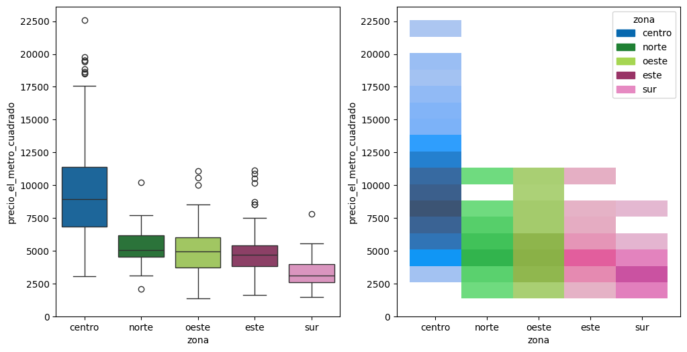
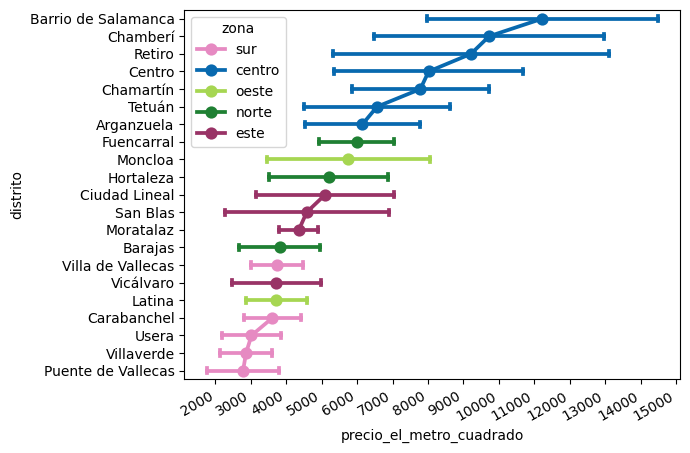

El siguiente gráfico muestra el `pmc` medio por `distrito`, con intervalos de confianza y codificación por `zona`. Permite identificar la jerarquía de `precios` a nivel de `distrito`, aunque algunos presentan muestras reducidas que limitan la robustez de las estimaciones.

### **CARACTERÍSTICAS**

#### PMC / Tipo de inmueble 

El siguiente gráfico compuesto analiza la distribución de `pmc` según tipo de inmueble (`piso`/`chalet`), incluyendo histogramas de densidad por localización.

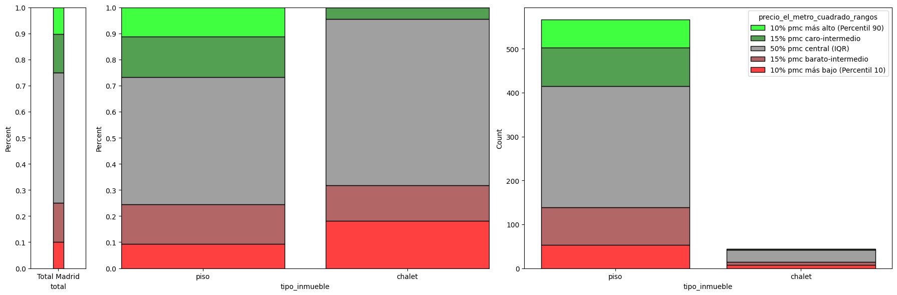

Los `chalets` muestran comportamiento inverso en `pmc` respecto a `pee`: aunque concentraban el 70% de sus observaciones en percentiles altos de `pee`, en `pmc` tienen sobrerepresentación de valores bajos y literalmente 0 viviendas en `p90`. 

Este contraste es revelador: confirma que el alto precio total de los `chalets` responde a su gran superficie, no a una valoración premium por metro cuadrado. De hecho, el `pmc` medio de los `chalets` es inferior al de los `pisos`, consecuencia directa de su ubicación en zonas periféricas donde el suelo es más barato. Los `pisos` se alinean casi perfectamente con la distribución total en ambas métricas, lo cual es esperable dado su peso muestral dominante (92.8%).

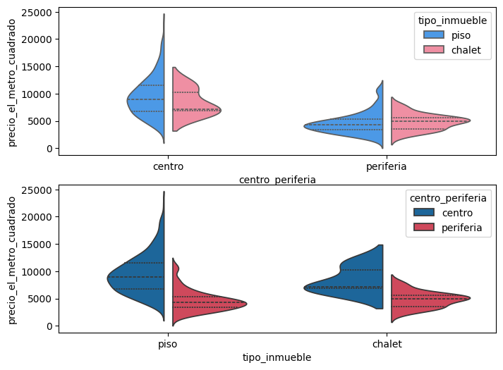

#### PMC / Número de planta 

Variables: **`planta`, `planta_rangos(_xl)` + `pmc`**

El siguiente gráfico compuesto muestra el `pmc` medio por rango de planta y la distribución de percentiles.

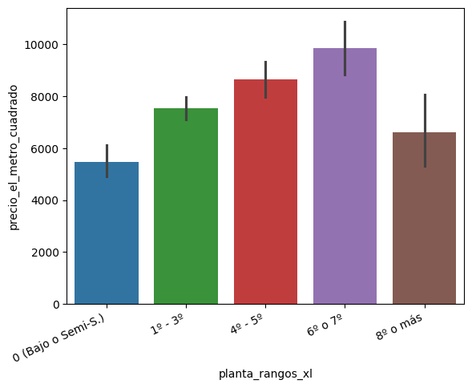

El `pmc` muestra relación positiva con la altura, aunque no lineal. Las `plantas bajas`/`semi-sótanos` presentan el `pmc` más bajo (~`4.800 €/m²`), seguidas de `chalets` (~`6.600 €/m²`). Las plantas intermedias oscilan entre `7.500 €/m²`-`8.700 €/m²`, con pico en plantas 6ª-7ª (~`10.000 €/m²`).

Las plantas `8ª+` descienden a ~`6.600 €/m²`, resultado que debe interpretarse con cautela por la muestra reducida (<20 obs.). Este descenso podría ser artefacto estadístico, o reflejar que las plantas muy altas en Madrid no siempre corresponden a producto premium —existen edificios de vivienda social en altura, por ejemplo, que reducirían la media del segmento.

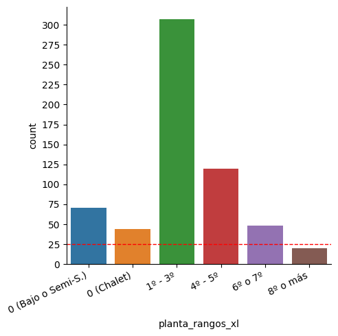

El gráfico de counts confirma que las plantas `1ª-3ª` dominan la muestra (~307 obs.), mientras que `plantas bajas`, `chalets` y `8ª+` tienen representación limitada (<75 obs. cada una), lo que aconseja prudencia en las conclusiones sobre estos segmentos.

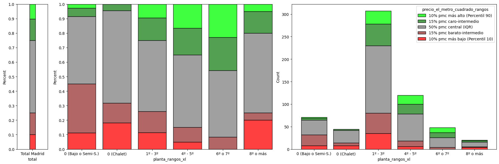

#### PMC / Exterior/Interior

Variables: **`exterior_interior` + `pmc`** 

El siguiente gráfico compuesto analiza la distribución de `pmc` según orientación (`exterior`/`interior`).

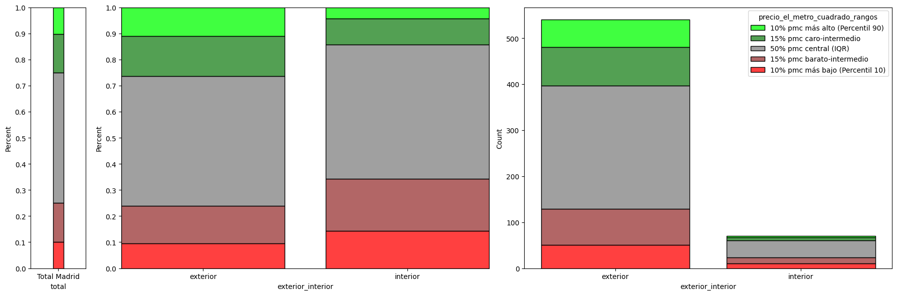

Un hallazgo interesante: los pisos `interior` incrementan ligeramente su presencia en percentiles altos de `pmc`, acercándose a paridad con los `exterior`. 

Esto sugiere que la condición `interior`/`exterior` explica diferencias en `pee` (los `interior` son más baratos en términos absolutos) pero es más neutral en `pmc`. La interpretación: las viviendas `interior` cuestan menos principalmente porque suelen ser más pequeñas, no porque el mercado las penalice significativamente por metro cuadrado. Este es un ejemplo claro de cómo el análisis conjunto de `pee` y `pmc` permite descomponer los factores que determinan el precio.

#### PMC / Estado de la vivienda 

Variables: **`nuevo_usado` + `pmc`** 

El siguiente gráfico compuesto muestra la distribución de `pmc` según estado de conservación.

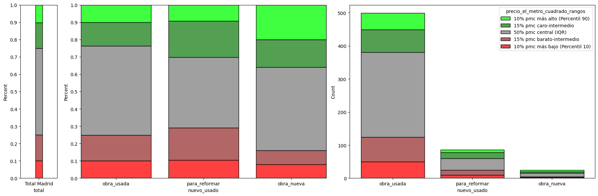

La `obra_usada` se alinea con la distribución total tanto en `pmc` como en `pee`, reflejando su heterogeneidad y peso muestral dominante. Las viviendas `para_reformar` se alinean en `pmc` pero tenían mayor peso de percentiles altos en `pee` —esto indica que son viviendas grandes (alto `pee`) pero con valoración por metro cuadrado similar al mercado general. La `obra_nueva` presenta alta variabilidad entre ambas métricas, aunque la muestra reducida (25 obs.) impide conclusiones robustas.

### **ESPACIO**

El cruce `pee` / `metros_cuadrados_rangos_xl` mostraba lo esperado: el precio total crece con la superficie.

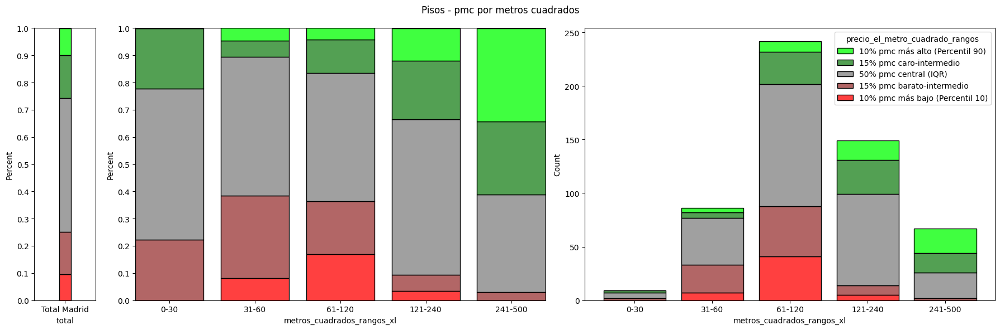

El cruce `pee`/superficie mostraba lo esperado: el precio total crece con la superficie. El cruce `pmc`/superficie revela un patrón menos obvio pero igualmente relevante: la representación de percentiles altos de `pmc` crece con el tamaño, llegando al 60% en el rango `241-500 m²`. Los rangos pequeños (`0-60 m²`) tienen mayor concentración de `pmc` bajo.

Este patrón sugiere que las viviendas grandes no solo cuestan más en términos absolutos (`pee`), sino que tienen mayor valor por metro cuadrado (`pmc`). 

La explicación más plausible no es que la superficie en sí genere una prima de precio, sino que las viviendas grandes tienden a ubicarse en zonas premium y a incorporar calidades superiores. Es decir, la correlación superficie-`pmc` está mediada por localización y calidad, no es una relación directa.

### **EQUIPAMIENTOS**

Esta sección replica el análisis de equipamientos realizado para `pee`, ahora con `pmc` como variable dependiente. La comparación permite distinguir qué equipamientos afectan al precio total (`pee`) por su correlación con el `tamaño`, y cuáles tienen efecto independiente sobre la valoración por metro cuadrado (`pmc`). Algunas relaciones son claras; otras no son concluyentes pero se documentan para completitud.

#### PMC / ascensor

Variables: **`ascensor` + `pmc`**

El siguiente gráfico compuesto muestra el `pmc` medio y la distribución por percentiles según disponibilidad de `ascensor`.

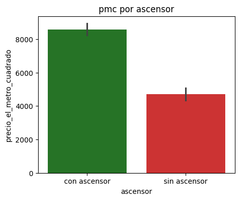

Las viviendas `con ascensor` presentan `pmc` de ~8.600 €/m² vs ~4.700 €/m² `sin ascensor`, una diferencia de ~83% que se mantiene tras normalizar por superficie. Este resultado es clave: el `ascensor` no solo correlaciona con viviendas más grandes (lo que explicaría diferencias en `pee`), sino con mayor valoración por metro cuadrado. Es la variable de equipamiento con mayor poder discriminante en ambas métricas, confirmando su rol como proxy de calidad del edificio y ubicación.

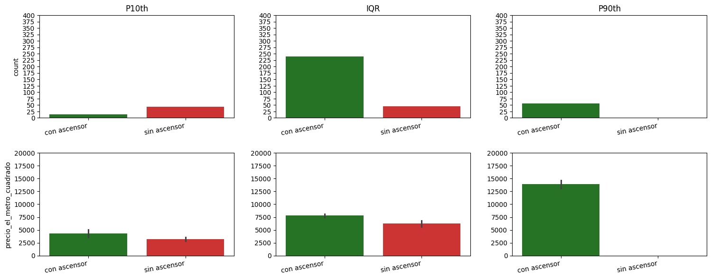

El histograma de proporciones confirma el patrón: las viviendas `sin ascensor` concentran la mayoría de sus observaciones en percentiles bajos de `pmc` (`p10` y `barato-intermedio`), mientras que las viviendas `con ascensor` presentan distribución desplazada hacia percentiles altos, dominando prácticamente en solitario el `p90`. El patrón replica casi exactamente el observado en `pee`, confirmando la robustez del efecto.

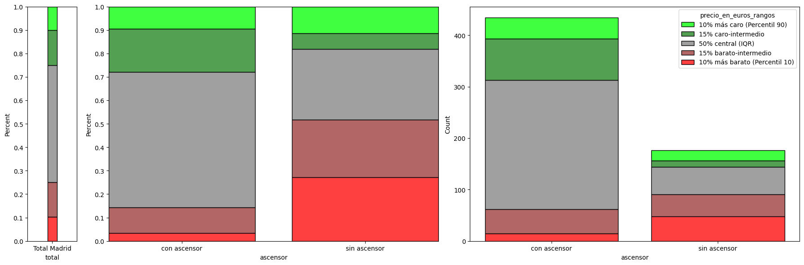

#### PMC / equip. servicios

Variables: **`equip_servicios` + `pmc`**

El siguiente gráfico compuesto muestra el `pmc` medio y la distribución por percentiles según disponibilidad de `garaje` y `trastero`.

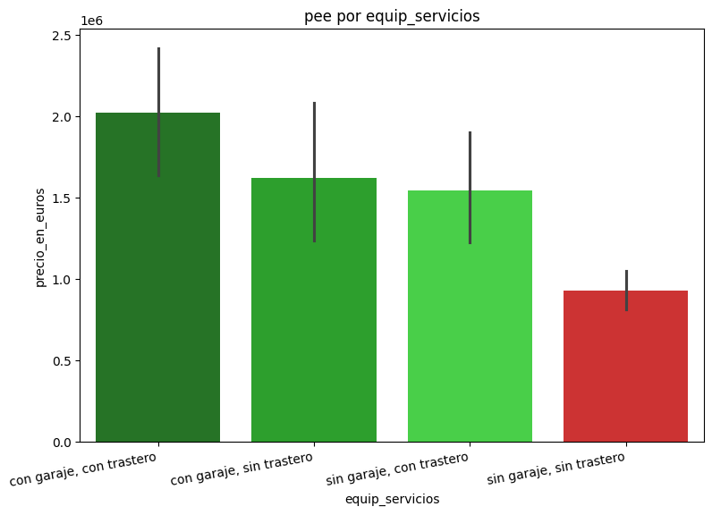

Las cuatro categorías muestran `pmc` similar (~8.000-8.300 €/m²), con `sin/sin` ligeramente inferior (~7.300 €/m²). El poder discriminante en `pmc` es menor que en `pee`, lo que sugiere que `garaje` y `trastero` correlacionan con viviendas más grandes (afectando `pee`) pero no añaden prima significativa por metro cuadrado. La limitación metodológica sobre la inclusión opcional de estos elementos en el precio, mencionada en la sección de `pee`, aplica igualmente aquí.

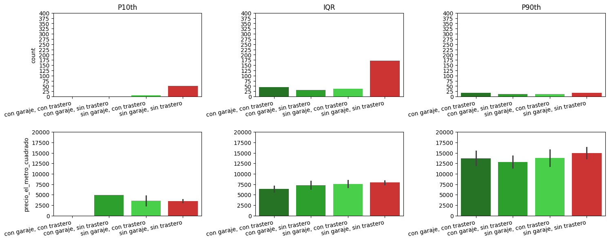

El histograma de proporciones muestra evolución gradual: `con/con` presenta mayor peso relativo en percentiles altos de `pmc`, patrón que se atenúa progresivamente hasta `sin/sin`, donde aumenta la concentración en percentiles bajos. Las diferencias son menos pronunciadas que en `ascensor`, coherente con el menor poder discriminante de esta variable.

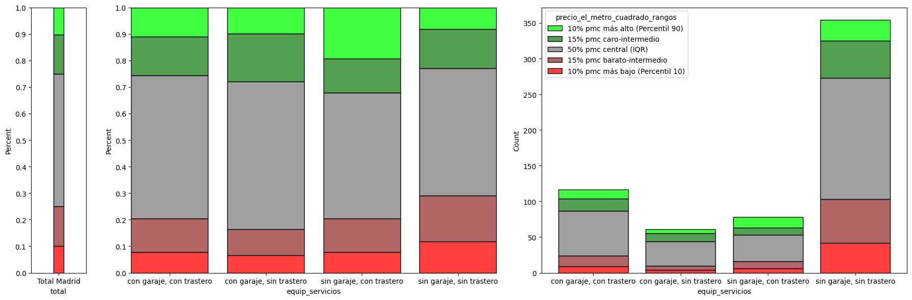

#### PMC / equip. espacios de ocio

Variables: **`equip_espacios_de_ocio` + `pmc`**

El siguiente gráfico compuesto muestra el `pmc` medio y la distribución por percentiles según disponibilidad de `jardín` y `piscina`.

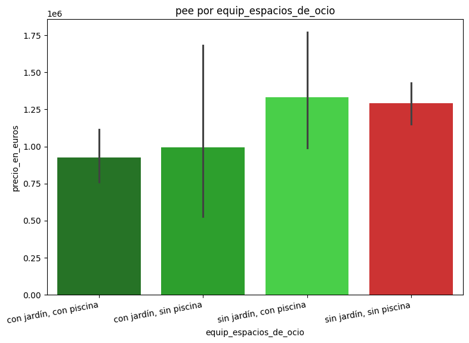

El patrón replica lo observado en `pee`: `con/sin` (jardín sin piscina) tiene el `pmc` más bajo (~`6.000 €/m²`), `sin/con` (piscina sin jardín) el más alto (~`8.400 €/m²`). La categoría `sin/sin` (~`7.900 €/m²`) domina en count. La persistencia de la relación inversa equipamiento/precio en `pmc` confirma que se trata de un efecto de localización, no de tamaño: `jardín` y `piscina` son más frecuentes en zonas periféricas de menor `pmc`, y este efecto no desaparece al normalizar por superficie.

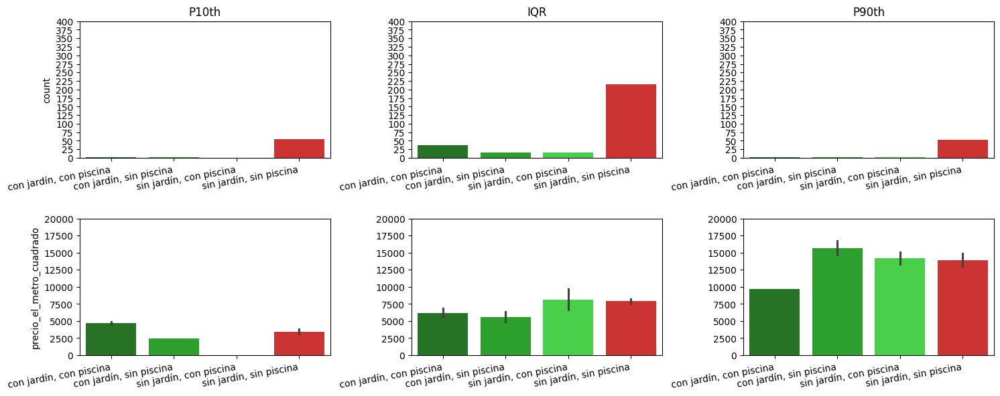

El histograma de proporciones refleja el patrón: `sin/con` (piscina sin jardín) muestra mayor concentración en percentiles altos de `pmc`, mientras que `con/sin` (jardín sin piscina) presenta mayor peso en percentiles bajos. La categoría `sin/sin`, pese a dominar en count absoluto, muestra distribución cercana a la poblacional. Este patrón refuerza la hipótesis de que el `jardín` está más asociado a ubicaciones periféricas de bajo `pmc`, mientras que la `piscina` comunitaria puede aparecer también en edificios céntricos de cierto standing.

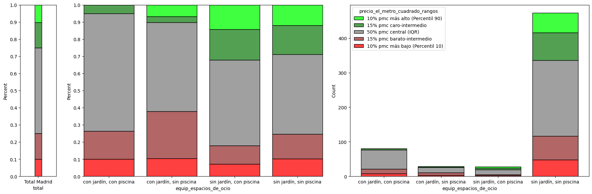

#### PMC / equip. vistas

Variables: **`equip_vistas` + `pmc`**

El siguiente gráfico compuesto muestra el `pmc` medio y la distribución por percentiles según disponibilidad de `balcón` y `terraza`.

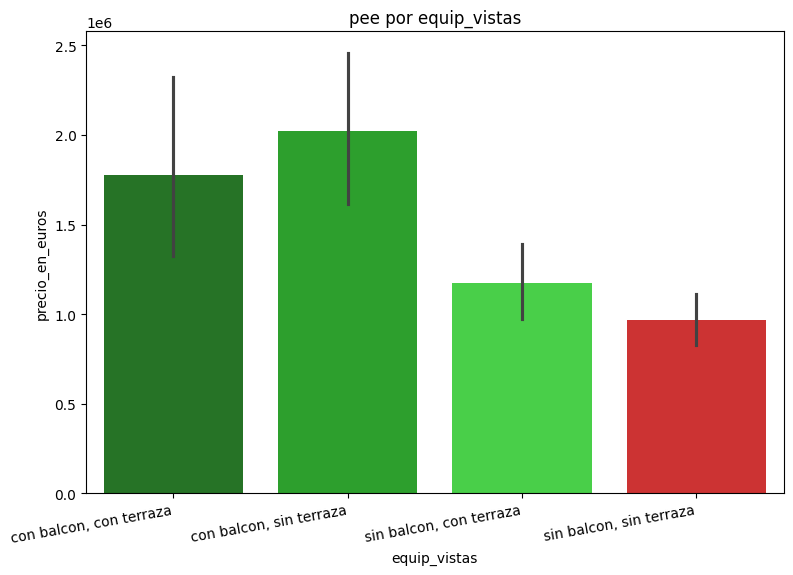

El `pmc` oscila entre `7.000 €/m²`-`9.500 €/m²`. La categoría `con/sin` (balcón sin terraza) presenta el valor más alto (~`9.500 €/m²`); `sin/con` (terraza sin balcón) el más bajo (~`7.000 €/m²`). El `balcón` muestra mayor asociación con `pmc` alto que la `terraza`, patrón consistente con `pee`. La hipótesis explicativa se mantiene: el `balcón` es más frecuente en pisos céntricos de edificios históricos, mientras que la `terraza` (sin balcón) suele asociarse a áticos o viviendas de la `periferia`.

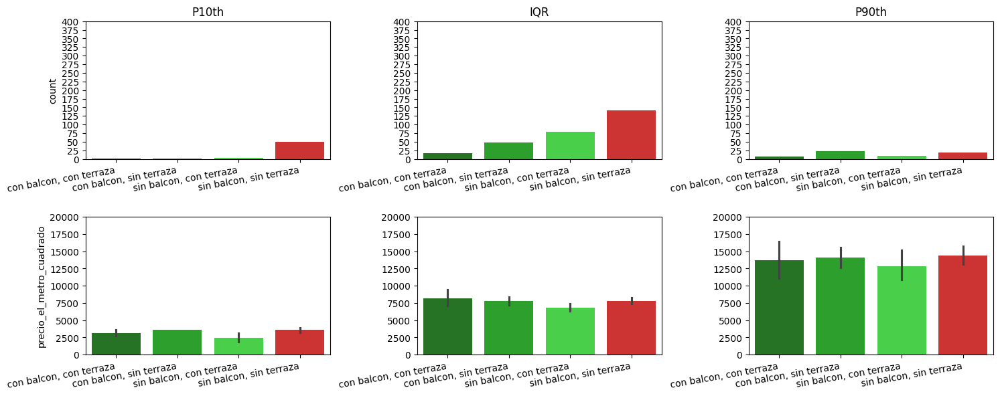

El histograma de proporciones confirma que las categorías con `balcón` (`con/con` y `con/sin`) concentran mayor peso en percentiles altos de `pmc`, especialmente `con/sin` (balcón sin terraza) que domina el `p90`. Las categorías sin `balcón` (`sin/con` y `sin/sin`) presentan distribuciones desplazadas hacia percentiles bajos-intermedios. El patrón es consistente entre `pee` y `pmc`, indicando que el efecto del `balcón` no se debe solo al tamaño de la vivienda.

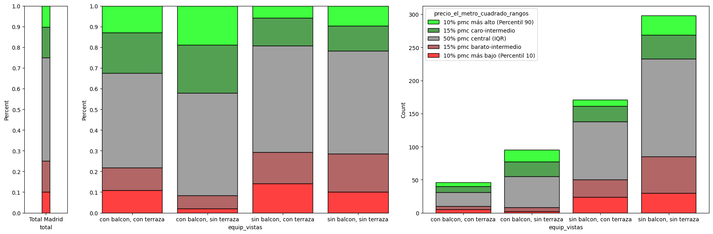

#### PMC / equip. de clima

Variables: **`equip_clima` + `pmc`**

El siguiente gráfico compuesto muestra el `pmc` medio y la distribución por percentiles según disponibilidad de `aire acondicionado` y `calefacción`.

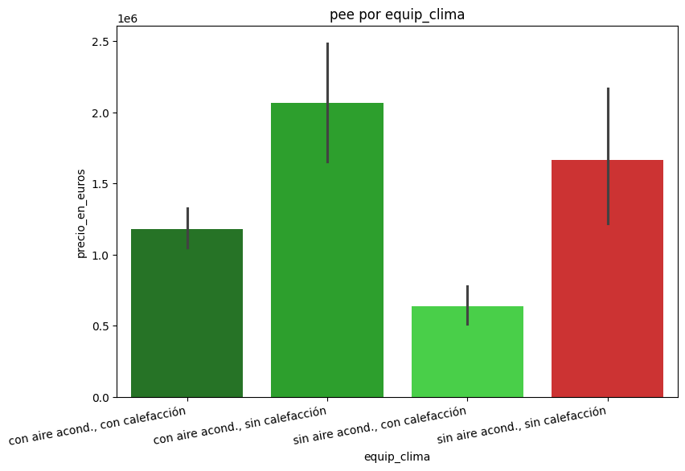

La categoría `con/sin` (aire sin calefacción) presenta el `pmc` más alto (~9.900 €/m²); `sin/con` (calefacción sin aire) el más bajo (~5.400 €/m²). El `aire acondicionado` muestra mayor asociación con `pmc` alto que la `calefacción`, patrón consistente con `pee`. Esta diferencia es incluso más pronunciada en `pmc` que en `pee`, sugiriendo que el `aire acondicionado` funciona como indicador de calidad/modernidad del inmueble que se refleja directamente en la valoración por metro cuadrado.

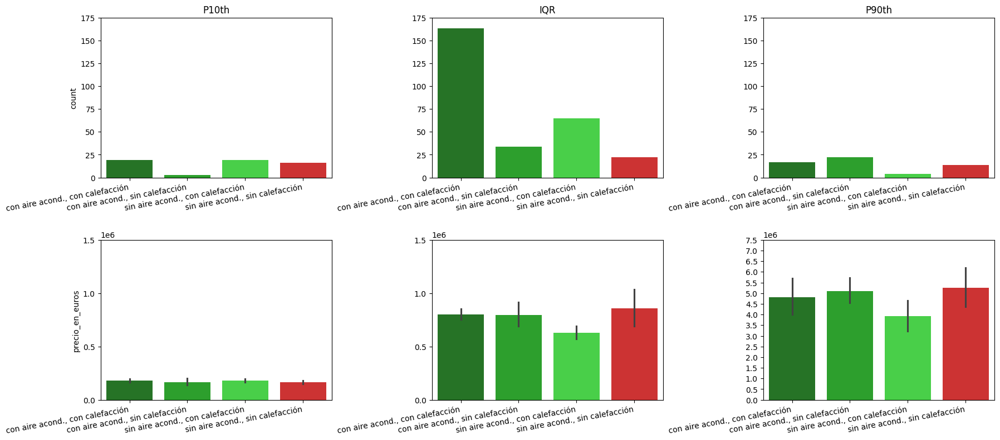

El histograma de proporciones muestra segregación clara: `con/sin` (aire sin calefacción) concentra la mayor proporción de viviendas en `p90`, mientras que `sin/con` (calefacción sin aire) domina en `p10`. La categoría `sin/sin` presenta distribución más equilibrada entre percentiles. Este patrón refuerza que el `aire acondicionado` es mejor predictor de `pmc` alto que la `calefacción`, consolidándose como una de las variables de equipamiento con mayor poder discriminante junto al `ascensor`.

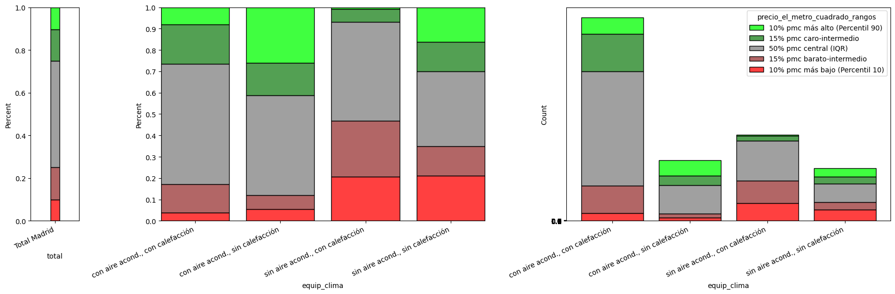

